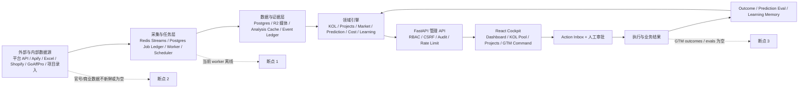
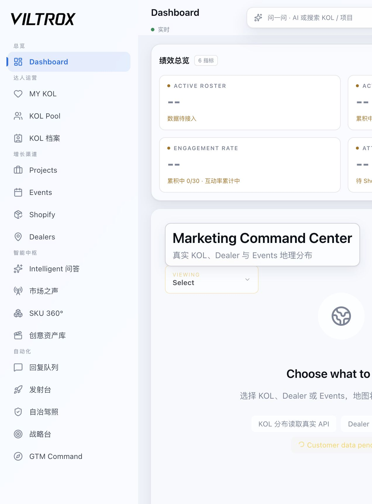
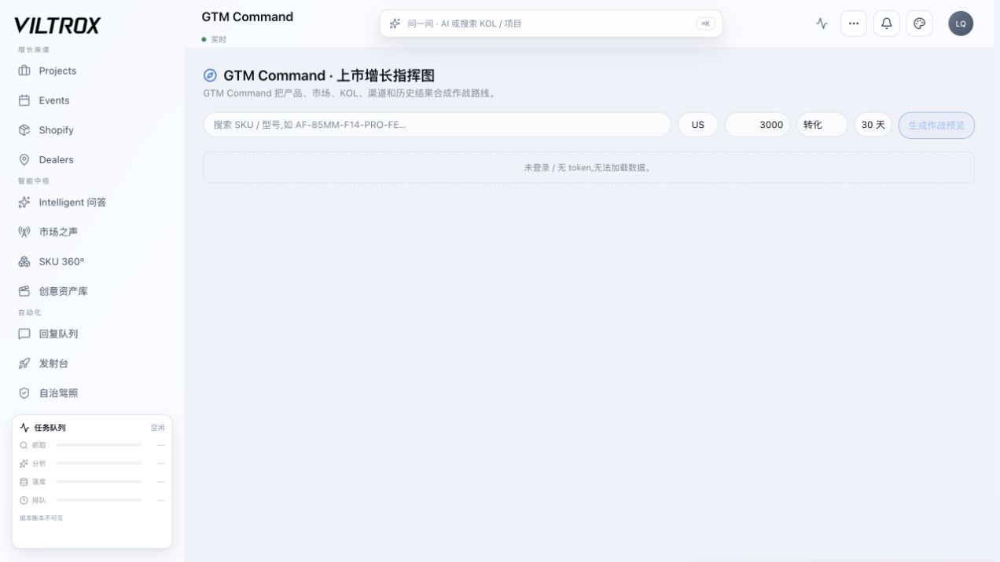
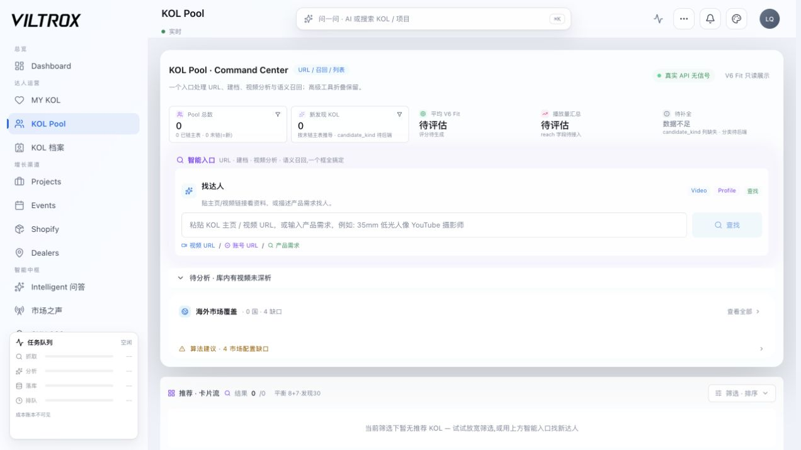

# V-KPI 内部系统深度评估

> **范围纠正（2026-07-09）：** 本文早期版本对 SKU/Projects 着墨过多，已由《V-KPI 完整大智能体与全系统 UI 深度评估》取代。新报告覆盖 21 个可达页面、全局壳层、大智能体、跨页执行与性能，不再把单一模块当成系统中心。

日期：2026-07-09（America/New_York）  
代码基线：`9bfcd4a944104e6b010a93df50d07ed7e5c44847`  
分支：`codex/dashboard-real`（相对 `origin/codex/dashboard-real` ahead 74）  
评估对象：当前已提交代码 + 当前未提交工作树 + 本地 `8102/5188` 运行态 + 本地 Postgres 真库  
评估性质：只做诊断和路线设计，不把旧报告、原型页面或测试通过等同于生产闭环成立。

---

## 1. 结论先说

### 1.1 当前成熟度

**综合成熟度：57/100，定位为“工程能力较强、数据资产可观、业务闭环尚未成立的内部强 Beta”。**

它已经不是简单 KPI 看板，也不是只有提示词的 AI 演示。它拥有 KOL 资产、视频证据、项目/活动/渠道/成本模块、权限治理、异步任务、预测与结果账本、Action Inbox、GTM 预览和完整前后端。但当前真正限制系统的不是“功能少”，而是：

1. **运行骨干不在线**：worker 心跳停在 2026-07-03，官号同步停在 2026-06-14。
2. **关键业务结果没有进入新闭环**：`vkpi_gtm_outcomes=0`、`vkpi_prediction_evals=0`、`vkpi_signal_ledger=0`、Shopify/GoAffPro 订单均为 0。
3. **现有数据大量停留在“导入/候选/建议”阶段**：项目分配 2,189 条中 2,179 条来自 Excel；616 条使用 placeholder tracking，而正式 shipment 只有 1 条、deliverable 为 0。
4. **当前 UI 开发速度超过工程治理承载力**：后端和 TypeScript 测试都绿，但发布总门禁因 635.7KB chunk 和 2,334 行新 CSS 文件失败。
5. **团队入口仍不可靠**：本轮浏览器验证无法用当前本地管理员配置登录，业务流被挡在登录页。

### 1.2 最重要的判断

> V-KPI 的下一阶段不应该继续横向加页面，而应该把一条真实业务链从“选人 → 执行 → 结果 → 复盘 → 权重更新”完整跑通。

当前最大的资产是“垂直数据 + 业务语义 + 人审治理骨架”；最大的风险是“模块越来越全，但系统没有持续产生可验证业务结果”。

### 1.3 成长性

- **作为 Viltrox 内部营销操作系统：成长性高，约 80/100。** 数据、流程和组织语境都已经存在，只要收口运行与结果链，价值会快速释放。
- **作为可出售的多租户 SaaS：当前就绪度低，约 32/100。** 核心 KOL、项目、活动、订单、Action Inbox、GTM outcome 表均没有组织隔离字段；商业化前需要逐表租户化、运营 SLO、数据治理和支持体系。
- **作为自主 AI Agent：现在不应扩大权限。** 结果与评估账本为空时，Agent 只能更快地产生建议，不能证明建议更正确。

---

## 2. 本轮证据基线

### 2.1 代码与规模

| 项目 | 当前事实 | 判断 |
|---|---:|---|
| 后端业务代码 | 1,124 个 Python 文件，约 271,000 行 | 已是大型模块化单体，不能再按“小工具”治理 |
| 前端代码 | 734 个 TS/TSX 文件，约 119,910 行 | 页面与状态面已经很宽 |
| 测试代码 | 203 个后端测试文件，约 28,964 行 | 测试资产强，但覆盖深度不均 |
| 数据迁移 | 379 个 SQL 文件，327 张 public 表 | 领域覆盖极宽，迁移和语义债很高 |
| 后端路由 | 108 个 V-KPI 管理路由模块，约 1,092 个路由声明 | API 面过宽，变更治理成本高 |
| 写路由 | 约 497 个 POST/PUT/PATCH/DELETE 声明 | 必须有 Action Registry、审计和按钮级验收 |
| 前端 API 层 | 68 个 service 文件 | 已具备分层，但契约测试覆盖很不平均 |

### 2.2 当前验证结果

| 验证项 | 结果 | 说明 |
|---|---|---|
| 后端测试 | **1749 passed / 6 skipped / 45 subtests passed** | 通过 |
| 前端 TypeScript | **通过** | 通过 |
| 前端 Vitest | **61 files / 368 tests passed** | 通过，但存在多处 `act(...)` 警告 |
| 后端覆盖率 | **40.7%** | 核心 worker/任务模块明显偏低，部分为 0-25% |
| 前端覆盖率 | **15.39% statements / 20.9% functions** | 大量路由、service、共享组件和原型为 0% |
| 前端生产构建 | **构建成功** | 但 chunk guard 失败 |
| chunk guard | **失败** | 最大 chunk 635.7KB，门限 600KB |
| 千行文件 guard | **失败** | 新 `cockpit-reference.css` 2,334 行，未在遗留白名单 |
| 仓库 hardening | **0 errors / 1531 warnings** | 警告主要集中在脚本裸 `print()`，治理噪音较大 |
| silent exception baseline | **失败：2 处，基线 0** | `gemini_video_results.py`、`availability.py` |
| server/client SHA | **一致** | 均为 `9bfcd4a9` |

### 2.3 当前运行态

| 项目 | 当前事实 | 健康度 |
|---|---|---|
| Admin API | `/health = ok` | 绿 |
| 数据库迁移 | 到 `233_vkpi_gtm_outcomes_inbox_unique.sql` | 绿 |
| 前后端 SHA | aligned | 绿 |
| scheduler | 31 项、21 项 enabled | 配置存在，但依赖 worker/进程实际执行 |
| worker | `worker_online=false` | **红** |
| worker 最后心跳 | `2026-07-03T11:44:31Z` | **红** |
| 本地登录 | 当前管理员入口返回账号或密码错误 | **红** |
| 官号最新同步 | `2026-06-14T04:27:36Z` | **红/过期** |
| 当日官号指标 | 0 行 | **红** |

---

## 3. 系统架构评估

### 3.1 实际架构

### 3.2 架构优点

1. **模块化单体方向正确。** FastAPI 主程序按 APP_ROLE 区分 public/admin/worker，V-KPI 路由通过注册表挂载；领域目录已覆盖 KOL、项目、市场、预测、学习、成本、证据等边界。
2. **权限纵深明显优于普通内部工具。** 有登录、RBAC、中间件级 admin gate、tab permission、manager/owner gate、CSRF、CORS 白名单、CSP/HSTS、安全审计和敏感访问日志。
3. **运行真相可见。** `/health` 显示 server/client SHA、迁移水位、worker 心跳和 scheduler 状态，能够避免“代码是新的、运行进程是旧的”这种常见假象。
4. **异步与实时骨架完整。** Redis Streams、Postgres job ledger、worker、SSE、polling fallback、任务中心和成本账本都已出现。
5. **GTM 预览的安全纪律好。** `gtm_plan_preview.py` 明确零写库、零 LLM、零采集，逐段失败降级，输出 basis/confidence/missing data，并限制绝对化措辞。
6. **人机边界清楚。** Action Inbox 大多数动作 `requires_approval=true`，GTM 物化默认 dry-run，避免建议直接变成业务写入。

### 3.3 架构缺点

1. **领域面过宽，已超过单团队稳定维护的舒适区。** 108 个管理路由模块、约 1,092 个路由、327 张表和 497 个写路由，说明系统已经在承担 ERP、CRM、KOL、媒体、BI、Agent 和 GTM Brain 多套产品职责。
2. **数据库访问仍高度分散。** 后端约有 3,504 个 `.execute(...)` 调用，repository 层只覆盖少部分领域；多数领域仍直接写 SQL，口径和权限容易在兄弟模块重复漂移。
3. **双重/多重领域命名增加认知税。** `market`、`market_brain`、`marketing_brain`，以及 `services/vkpi` 兼容 shim 与 `domains/*` 并存，迁移期可接受，但需要最终 ownership map。
4. **兼容层正在成为永久架构。** SQLite/Postgres placeholder 翻译、历史 schema、软关联和大量 shim 让旧功能继续可用，但也扩大了测试矩阵和隐性失败面。
5. **核心业务表没有统一租户边界。** 只有 signal/prediction/event/workflow 等新账本带 `organization_id`；KOL、产品、项目、活动、Shopify、GoAffPro、Dealer、Action Inbox、GTM outcome 均未隔离。
6. **软关联过多，审计账本已出现完整性损失。** `action_approved/action_executed` 事件 177 条中 157 条找不到现存 Action Inbox；执行账本 35 条中 19 条为 orphan。测试/清理流程也会留下孤儿事件。

---

## 4. 八维评分卡

评分不是“代码数量分”，而是看系统能否稳定服务团队并形成可验证业务结果。

| 维度 | 分数 | 核心依据 |
|---|---:|---|
| 功能与领域覆盖 | **82** | KOL、项目、活动、渠道、成本、证据、AI、GTM、Action Inbox 齐全 |
| 工程正确性 | **71** | 1749 后端测试、368 前端测试、TypeScript 绿；但发布门禁红、覆盖率不均 |
| 数据资产与质量 | **63** | 1,225 KOL、2,717 视频证据、1,202 条 raw data；深层真实性仍不足 |
| 运行与可观测性 | **38** | worker 离线、同步陈旧、队列失败/阻塞高、登录入口不可靠 |
| 产品与团队可用性 | **50** | 信息架构完整、空态诚实；但入口阻塞、导航过密、真实流程未能本轮走通 |
| 智能闭环成熟度 | **35** | 预测与账本结构存在，但 GTM outcome/eval/signal 全为空 |
| 安全与治理 | **64** | RBAC/CSRF/CSP/审批/成本/审计较强；SSE token query、软关联和单租户仍有风险 |
| 可维护性与扩展性 | **52** | 模块化方向好；规模、SQL 分散、巨文件、`any` 和兼容层拖累 |
| **综合** | **57** | **内部强 Beta；功能完成度高于业务完成度** |

---

## 5. 数据资产：强在哪里，缺在哪里

### 5.1 KOL 数据资产

本地当前 `vkpi_kol_pool=1,225`：

| 字段/能力 | 数量 | 覆盖率 | 判断 |
|---|---:|---:|---|
| platform + handle | 1,225 | 100% | 基础身份可靠 |
| profile URL | 1,184 | 96.7% | 好 |
| display name | 1,115 | 91.0% | 好 |
| followers > 0 | 1,056 | 86.2% | 可用于基础筛选 |
| country | 981 | 80.1% | 市场匹配尚可 |
| V6 fit score | 999 | 81.6% | 评分覆盖可观，但需要结果校准 |
| engagement rate | 601 | 49.1% | 中等，仍有较大空洞 |
| 视频证据 | 510 | 41.6% | 资产有规模，但未覆盖多数 KOL |
| 可联系 | 376 | 30.7% | 直接限制外联转化 |
| real ER | 125 | 10.2% | 深度真实性不足 |
| verified | 0 | 0% | “系统认为已验证”的正式口径尚未启动 |

优点是上游资产已经真实成规模；弱点是“可发现”远强于“可联系、可验证、可评估结果”。

### 5.2 项目与履约数据

- `vkpi_projects=58`
- `vkpi_project_kol_assignments=2,189`，其中 Excel/Excel incremental 共 2,179 条
- assignment 中 616 条带 placeholder tracking
- `vkpi_shipments=1`
- `vkpi_project_deliverables=0`
- `vkpi_events=5`，event task=0，evidence=0，retrospective=0

这意味着项目阶段看起来很丰富，但大量是历史 Excel 状态映射，不等于系统内完成了真实履约。Dashboard、漏斗和北极星必须默认区分：

- imported historical state
- placeholder state
- system-confirmed state
- evidence-confirmed state
- outcome-confirmed state

否则系统会把“Excel 里写了 device_sent/content_posted”误显示成“系统闭环已经成立”。

### 5.3 商业结果与智能账本

| 表/能力 | 当前水位 | 判断 |
|---|---:|---|
| Shopify orders | 0 | 无 GMV 真相 |
| GoAffPro sales | 0 | 无联盟销售真相 |
| Dealer | 0 | 渠道大脑缺数据 |
| Brand signals | 0 | 市场信号层未点火 |
| Signal ledger | 0 | Market Brain 缺统一血液 |
| Prediction runs | 399 | 有预测，但主要是 quantile baseline/evidence model |
| Prediction evals | 0 | 无法证明预测有效 |
| GTM outcomes | 0 | 产品×市场×渠道闭环未开始 |
| Action Inbox | 291 | 建议很多 |
| Action executed | 13 | 约 4.5%，执行转化弱 |
| Bet ledger | 2 | 试验性 |
| AI cost ledger | 3,405 行，累计约 $121.53 | 成本可追踪是优点 |

最关键的反差是：**预测有 399 条，但评估为 0；建议有 291 条，但 executed 只有 13；新 GTM outcome 为 0。**

---

## 6. 队列、worker 与运行可靠性

### 6.1 当前队列水位

`apify_jobs=2,185`：

- done 1,529（70.0%）
- failed 398（18.2%）
- blocked 235（10.8%）
- triage 21
- queued 2

`job_execution_ledger=461`：

- done 297（64.4%）
- failed 144（31.2%）
- queued 18
- draft/cancelled 2

`vkpi_reply_queue=132`：pending 130、drafted 1、replied 1。

### 6.2 判断

系统不是没有任务能力，而是缺一个持续在线、可被运营的异步生产线。队列错误不能只靠数据库状态堆积，至少需要：

1. worker heartbeat SLO；
2. queued age / failed rate / retry exhaustion 指标；
3. provider、数据、权限、业务校验四类失败分桶；
4. triage owner 和 SLA；
5. 一键安全重试与死信清理；
6. worker 版本与 server/client 版本独立打戳，不能用 “assumed_same_repo”。

---

## 7. 代码层优缺点

### 7.1 代码层优点

1. **测试文化已形成。** 后端端点烟测、PG 并发、权限矩阵、金额/货币、写校验、前端 smoke 与 normalize tests 都存在。
2. **工程门禁不是摆设。** chunk DAG、600KB 上限、千行文件 guard、写点红线、SHA alignment 会真实拦截发布。
3. **安全和真实性意识强。** 代码中大量明确区分 dry-run、read-only、requires approval、missing data、confidence、basis、side effects。
4. **成本治理领先。** LLM cost ledger、budget guard、provider fallback、模型路由和失败重试都有基础。
5. **运行诊断可落地。** health 能直接暴露迁移、版本、worker 和 scheduler，而不是只返回 `ok`。

### 7.2 代码层缺点

1. **覆盖率与测试数量不匹配。** 1,749 个后端测试只覆盖 40.7%；前端 368 个测试只覆盖 15.39%。大量测试是 smoke/contract/fake-conn，关键 worker、真实网络边界和页面流程仍薄。
2. **前端类型债明显。** 非测试代码约有 1,176 处 `any` 命中；宽容 normalizer 防页面崩溃的同时，也会掩盖后端契约漂移。
3. **异常处理过宽。** 后端约 1,987 处 `except Exception`；虽多数有日志/降级，但维护者很难判断哪些是预期失败、哪些是数据损坏。
4. **巨文件仍多。** 后端 3 个 >1,000 行、前端源码 1 个 >1,000 行，另有 2,334 行新 CSS；`main.py`、GTM preview、项目 router 等也接近千行。
5. **脚本治理噪音过高。** hardening 1,531 warnings 会让真正的新增风险淹没在历史噪音中。
6. **测试隔离存在泄漏。** 本轮验证后发现最近产生的 3 条 action event 为 orphan、2 条预测为当前时间；说明 PG 测试或伴随流程可能对共享本地库留下痕迹。测试库必须与业务库物理隔离。

---

## 8. 系统体验与界面审计

### 审计范围和限制

本轮只使用本次实际捕获的截图。真实业务页面被登录失败挡住，因此：

- 登录页属于真实本地运行态；
- Dashboard、GTM Command、KOL Pool 为当前 DEV prototype 路由；
- prototype 能证明当前信息架构、空态和视觉方向，**不能证明带 token 的真实业务流程可用**；
- 截图不能证明完整 WCAG 合规，键盘、读屏和响应式仍需专项测试。

### Step 1：登录入口 —— 健康度：红

优点：入口简洁、焦点边框清楚、版本 SHA 可见。  
问题：当前管理员配置无法登录；错误文本为普通 generic 内容，未看到 `alert/live region` 语义；页面大面积空白，缺少环境说明、测试账号检查或恢复入口。

### Step 2：Dashboard prototype —— 健康度：黄

优点：模块分组清楚；KPI 空态明确写“待接入/累计中”，没有拿 lifetime 冒充 30D；任务与成本可见；版本同步明确。  
问题：左侧导航达到 18 个核心入口，认知负担过高；正文密度大、浅色文字对比偏低；截图可见部分内容横向超出当前画幅，需检查 1280px 和缩放场景。

### Step 3：GTM Command prototype —— 健康度：黄偏红

优点：输入对象（SKU、国家、预算、目标、窗口）明确；未登录时禁用生成，状态诚实。  
问题：没有 token 时整页几乎空白；缺少示例、数据准备度、下一步入口和可用 SKU 提示；表单控件在一行内过密，小屏和 200% zoom 风险高。

### Step 4：KOL Pool prototype —— 健康度：黄

优点：把 URL 建档、视频分析、语义召回收进一个主入口；数据不足时明确展示 0/待评估/字段缺失；卡片与表格共享筛选思路正确。  
问题：标题、状态、标签、提示和按钮同时竞争注意力；字号与颜色偏轻；“真实 API 无信号”“字段待后端”等技术说明对普通员工不够行动化，应该改成“你现在可以做什么”。

### UX 收敛建议

把 18 个模块入口重组为 4 个员工任务：

1. **找人**：KOL Pool、KOL 档案、MY KOL；
2. **推进合作**：Projects、寄样、内容、回复队列；
3. **看结果**：Dashboard、Shopify、成本、归因；
4. **做决策**：GTM Command、市场信号、Action Inbox。

其余设置、实验、Agent、数据质量和高级策略进入“运营/管理”二级区。首页只显示当前角色当天需要处理的 3-7 项工作，不再把所有能力同时展示。

---

## 9. 风险清单

### P0：不修就不能宣称团队可用

1. **worker 离线**：任务、同步、三窗回填和闭环 job 不可靠。
2. **本地/测试登录不可用**：浏览器业务验收无法开始。
3. **发布门禁红**：新 UI chunk 和 CSS 已突破既有规则。
4. **商业结果为空**：Shopify/GoAffPro/GTM outcome/prediction eval 均无数据。
5. **同步陈旧**：官号数据停在 6 月 14 日，Dashboard 的“实时”标签不成立。

### P1：会持续放大维护和数据风险

1. Action/event/执行账本软关联大量 orphan；
2. PG 测试可能污染共享本地业务库；
3. 前端覆盖率 15.39%，关键真实流程测试不足；
4. 497 个写路由与大量按钮缺统一 Action Registry；
5. 核心表无租户字段；
6. SSE 使用 query token，可能进入访问日志，应迁移到 HttpOnly cookie 或 fetch stream；
7. Excel/placeholder 状态可能被 Dashboard 当成已验证业务事实。

### P2：不影响当前自用，但会限制未来上限

1. market/market_brain/marketing_brain ownership 重叠；
2. repository 层覆盖不足；
3. 巨文件和兼容 shim 长期存在；
4. observability 仍依赖可选 Sentry 和进程内指标；
5. UI 模块导航继续扩张会让员工找不到每日主线。

---

## 10. 优化方案与执行顺序

### 阶段 A：止血与恢复运行真相（0-2 周）

目标：让系统重新满足“能登录、能跑任务、能构建、数据是新的”。

1. **冻结新增页面一周，只收 P0。**
2. 把 `cockpit-reference.css` 按 chrome/dashboard/components/motion 拆分；把 635.7KB chunk 降到 <600KB，重新跑 `make verify`。
3. 修复 2 个 silent exception；把 hardening warning 设为“只拦新增”，历史噪音分批清理。
4. 建立可复现本地管理员流程：`check_local_login.py` + local-only reset/seed + 浏览器 smoke，不在文档中保存共享密码。
5. 恢复 worker，要求 `/health.worker_online=true`，并记录真实 worker SHA；处理 queued/triage，给 failed/blocked 分桶。
6. 恢复官号同步，要求当日 metric rows > 0，Dashboard 所有“实时”标签必须由 freshness gate 控制。
7. 将 PG 测试强制指向独立数据库；测试结束后检查 orphan delta 必须为 0。

验收门槛：

- `make verify` 全绿；
- frontend 368 tests 全绿且关键 `act` 警告清零；
- 登录 smoke 通过；
- worker 心跳 <2 分钟；
- 官号 freshness <24 小时；
- 共享业务库无测试新增行。

### 阶段 B：跑通一条真实闭环（2-6 周）

目标：不追求全量，先证明系统能够学习。

选择：**1 个 SKU × 1 个市场 × 5 个 KOL × 1 个 28 天周期**。

完整链路：

1. GTM Preview 生成可追溯建议；
2. materialize 到 Action Inbox；
3. 人工审批并执行；
4. 项目/寄样/内容证据进入系统；
5. 7/14/28 天窗口回填；
6. `vkpi_gtm_outcomes` 产生真实行；
7. `vkpi_prediction_evals` 对答案；
8. 周复盘记录 validated/failed/partial；
9. 只有样本达到门槛后才更新权重。

验收门槛：

- GTM outcome > 0；
- prediction eval > 0；
- Action Inbox 从 suggested 到 executed/verified 有完整 trace；
- 结果可以回溯到 KOL、项目、证据、成本和订单；
- 页面能展示“建议是否正确”，而不只是“建议是什么”。

### 阶段 C：数据治理和团队日用（4-10 周）

1. 建立统一 Metric Registry：定义口径、owner、刷新频率、来源、fallback、freshness、drilldown。
2. 每个 Dashboard 数字增加状态：live/stale/imported/placeholder/estimated/verified。
3. Action Registry 覆盖全部写按钮：route、权限、审计、幂等、预期结果、回滚、验收测试。
4. 清理 action/event/execute orphan，关键桥接改 FK 或 durable tombstone。
5. 把 KOL 深度指标作为数据产品：verified、contactable、real ER、video evidence、last verified。
6. 把首页从模块目录改成角色工作台：今日待办、阻塞、即将到期、数据异常、结果复盘。
7. 优先提高 auth、worker、Action Inbox、Project flow、GTM loop 的覆盖率；不追求盲目全仓 80%。

### 阶段 D：智能成长与产品化（3-12 个月）

1. 先填 `signal_ledger`，再做 Channel Brain；
2. 持续积累 prediction eval，输出 Brier/MAE/interval hit/FVA，而不是只给 confidence 文案；
3. 建立每周“模型比 naive baseline 多创造多少价值”的评审；
4. 形成按 SKU/市场/渠道的策略记忆，不跨口径直接共享权重；
5. 如果要服务第二品牌，再启动核心表逐表 organization_id、RLS/应用层 scope、租户迁移和隔离测试；
6. autonomous execution 只开放给低风险、可回滚、可验证动作，高成本/对外发布/数据覆盖继续人审。

---

## 11. 未来成长路径

### 11.1 0-3 个月：内部营销操作系统

价值重点不是“AI”，而是把 Viltrox 团队每天的找人、寄样、内容、订单、复盘放进一个有证据和责任人的系统。

成功信号：

- 80% 新合作在系统内建立；
- 关键动作 owner 明确；
- worker/SLA 稳定；
- Dashboard freshness 可解释；
- 至少完成一轮 28 天 GTM 结果闭环。

### 11.2 3-6 个月：决策智能系统

当 outcome/eval 有样本后，V-KPI 才能从“工作流系统”升级成“决策系统”。真正护城河会是：

- 哪类 KOL 对哪个镜头/市场有效；
- 哪种内容角度带来真实播放、点击和订单；
- 哪个渠道组合在什么预算下更有效；
- 哪些建议被证伪，以及系统如何因此改变。

### 11.3 6-12+ 个月：垂直产品化

若要对外出售，建议只卖一个窄切口：**硬件品牌新品上市的 Creator-to-GTM 操作系统**，不要一次卖完整 ERP/CRM/BI/Agent 平台。

产品化前置条件：

- 多租户隔离；
- 配置化指标和工作流；
- 数据连接器安装/监控；
- 账单与 LLM 成本分租户；
- 审计、删除、导出和数据保留策略；
- 运营支持与迁移工具；
- 至少 2 个品牌的真实闭环对照，而不是复制 Viltrox 规则。

---

## 12. 最终优先级

### 必须马上做

1. 发布门禁回绿；
2. 登录恢复；
3. worker 恢复；
4. 同步恢复；
5. 测试库隔离；
6. 跑一个真实 28 天闭环。

### 应该随后做

1. Action Registry + Button Telemetry；
2. Metric Registry + freshness/lineage；
3. 清理 orphan 与 placeholder 口径；
4. 收口导航和员工首页；
5. 提升核心链路覆盖率。

### 暂时不要做

1. 继续增加新的 Brain 页面；
2. 在 outcome/eval 为 0 时扩大 Agent 自动执行权限；
3. 在核心表未租户化时接第二品牌；
4. 用更多 LLM 文案替代真实同步、订单和结果回填；
5. 为了演示效果用 lifetime/placeholder/Excel 状态冒充实时业务 KPI。

---

## 13. 最终判断

V-KPI 的代码和产品构想已经跨过“能不能做”的阶段，进入“能不能稳定成为公司运营系统”的阶段。

它的上限不低：KOL、视频、项目、渠道、成本、证据、预测和行动已经被放进同一套语义体系；这比普通 Dashboard 有更高的复利潜力。但系统当前仍缺最关键的血液：持续在线的 worker、新鲜数据、真实订单、执行结果、预测评估和日常团队使用。

**所以最正确的增长动作不是继续扩功能，而是让现有系统完整赢一次：用一个真实 SKU 跑完 28 天，留下可追溯结果，再让系统据此改变下一次建议。**
