# V-KPI 完整大智能体与全系统 UI 深度评估

日期：2026-07-09（America/New_York）  
代码基线：`9bfcd4a944104e6b010a93df50d07ed7e5c44847`  
分支：`codex/dashboard-real`（相对远端 ahead 74）  
范围：21 个当前可达板块、全局壳层、Agent/Workflow/Memory/Learning、运行态、数据库与前端性能  
验证方式：已使用真实 Admin 会话对当前系统逐页只读走查，并与代码、当前本地数据库快照交叉验证；未执行审批、分配、建组、发送、生成业务数据等写操作。Admin 实机截图位于 `admin_live_audit/`，原型截图保留用于同构建对照。

---

## 0. 先纠正产品定位

这套系统的核心不是 SKU 录入，也不是 Projects 页面，更不是“找 KOL 的工具”。

正确定位应当是：

> **一个持续观察完整营销系统、发现 KOL 执行风险、组织下一步动作、监督落实并从结果中学习的 AI Marketing Operating System。**

SKU、Project、Event、Shopify、Dealer 都只是世界状态的一部分；KOL 执行才是当前最重要的被监督对象。大智能体不应该再成为侧栏里的第 22 个页面，而应该成为所有页面共用的控制层。

目标主链应当是：

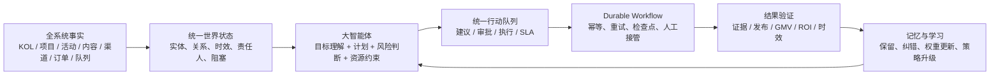

---

## 1. 结论先说

### 1.1 当前系统是什么水平

| 评价对象 | 当前评分 | 判断 |
|---|---:|---|
| 完整系统成熟度 | **56/100** | 工程和模块很强，但跨页协同与真实执行结果偏弱 |
| Marketing Brain 行为评分卡 | **54.8/100** | 官方代码口径；属于 capability stack，不是自主大脑 |
| 真正的认知/监督能力 | **约 38/100** | 感知、记忆有基础，规划、监督和学习明显不足 |
| 全系统 UI 一致性与顺畅度 | **51/100** | 页面多且能到达，但壳层负载、重复入口、主题与状态口径不统一 |
| 内部系统成长性 | **82/100** | 垂直数据、流程语义和治理骨架稀缺，值得继续投入 |
| 当前 SaaS 化就绪度 | **约 35/100** | 多租户、SLO、数据隔离、可配置流程和支持体系尚未成熟 |

### 1.2 最重要的三个判断

1. **当前不是“一个大智能体”，而是一组智能零件。** 证据、工作流、审批、记忆、评估都存在，但没有统一世界状态和持续监督主循环。
2. **系统的 UI 问题不是颜色或卡片不够漂亮，而是每个页面各自理解业务。** Intelligent、AI Today、GTM、战略台、Agent Loop、Action Inbox、任务中心和回复队列都在表达“下一步”，却没有一个统一任务真相。
3. **卡顿根因主要在壳层和数据加载策略。** 冷启动任何页面都会预取 Dashboard、全量 KOL、用户、提醒与团队数据；按当前 1,222 个 KOL 估算，进入任意页面前至少约产生 15 个基础请求，页面自身还会继续请求。

### 1.3 现在不该做什么

- 不应继续把每个新能力做成新的侧栏页面。
- 不应把“能回答问题”当作“大智能体已经聪明”。
- 不应先扩大自治权限；当前 7 天 workflow、真实反馈、新鲜市场信号都不足。
- 不应把导入状态、建议状态、系统确认状态和结果确认状态混成一个 KPI。

### 1.4 真实 Admin 实机复核：原判断被强化，三项上调为 P0

| 实机对象 | 当前证据 | 直接判断 | 优先级 |
|---|---|---|---|
| Dashboard | Active Roster 18、Active 30D 18、曝光 21.90M、互动率 3.98%；Worker 离线、2 个等待任务；90 天 North Star 仅 1% | 总览能展示，但数据健康和执行状态不足以支持日常指挥 | P0 |
| 全局搜索 / Intelligent | 输入跨域管理问题后，被归类成固定意图“KOL 内容 ROI 排名”，返回 0 行 | 现在是关键词路由，不是能拆问题、查多源、校验再出报告的智能体 | P0 |
| Report | 同一会话显示 Active Roster 525、Active 30D 120、曝光 2.05B、互动率 1.71% | 报告与 Dashboard 不是同一指标事实，管理层不能据此决策 | P0 |
| MY KOL / 团队管理 | 同屏出现 20 位负责人、18 个账号、717 MY KOL、1 个库对象；20 人全部无活跃/登录时间，0 组、0 协作设置 | 人员目录存在，但 ownership、成员互动和工作交接不可信 | P0 |
| Projects | 页面显示 34 个项目；数据库有 58 个项目、2,189 条 assignment，大量历史/占位 tracking 混入阶段 | 项目页面可推进已有工作，但还不是干净的执行事实源 | P0 |
| Strategy / GTM | Strategy 有 SoV、机会矩阵、模拟器；GTM 有治理信息，但 GTM outcome 为 0、North Star 基本未推进 | “分析面”比“路线执行与结果验证”成熟 | P0 |
| 提醒 / 通知 | 工作提醒为 0，今日建议 12，未读通知 74；含 smoke/audit 噪音 | 同一种工作被拆成多套队列，且缺 owner、SLA、去重与优先级治理 | P0 |
| 创意资产库 / Events / Dealers | 创意库持续“检索中”；Events 含测试名、NaN 和 9642 天活动；Dealer 为 0 且地图瓦片异常 | 个别页面虽可到达，尚不具生产可用性 | P0/P1 |
| Reply Queue | 132 条中 pending 130、replied 1；语言和问题类型有明显误判 | 有待办池，没有形成可运营的回复生产线 | P0 |
| Autonomy | 部分动作显示 100% 但样本仅 n=2，其余 n=0；prediction eval 为 0 | 治理框架先进，证据不足，暂不应扩大自治 | P0 |

关键实机截图：

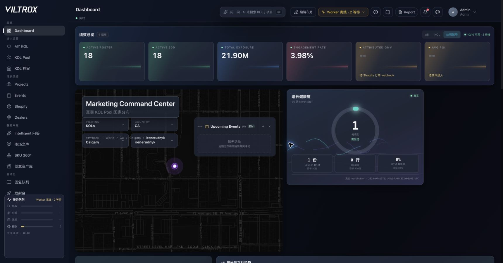

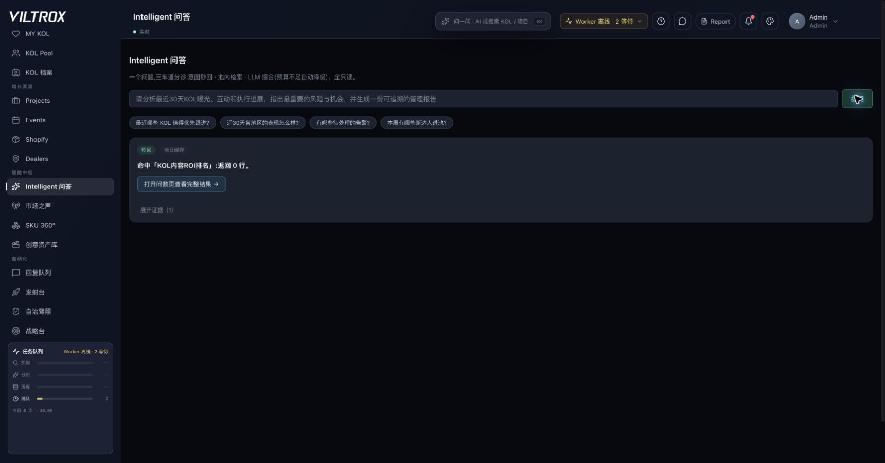

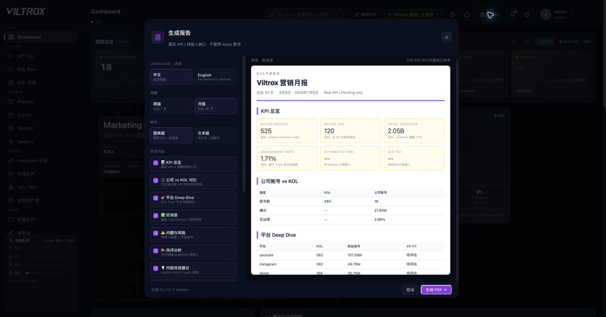

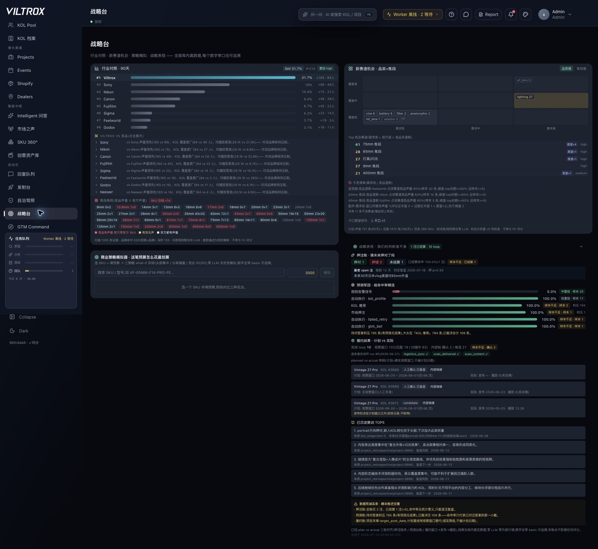

### 1.5 数据可信度复核

| 检查 | 当前结果 | 风险 |
|---|---:|---|
| 公司账号指标最新日期 | 2026-06-14 | 当前实例时区下已陈旧 26 天 |
| 叙事日报最新 report date | 2026-06-29 | 报告日期比底层指标新 15 天，必须同时展示 source date |
| 连续账号快照点赞不变 | 463/484，**95.7%** | 日更行存在，不代表互动数据真的更新 |
| 连续账号快照评论不变 | 457/484，**94.4%** | 趋势图可能把冻结字段画成稳定业务 |
| Worker heartbeat | 距当前约 **6.7 天** | 补全、检索、分析和队列无法持续推进 |
| Action executed | 13/291，**4.5%** | 建议没有变成足够多的已验证动作 |
| 开放告警 | 74 | stalled review 39、recommendation gap 27，占主要噪音 |
| 结果评估 | 98/98 success | 只有一个标签取值，不能训练或证明策略优劣 |
| GTM outcome / prediction eval | 0 / 0 | 战略和自治没有真实结果基线 |

结论：所有管理图表都必须把 **指标值、口径版本、数据截至、来源健康、样本量、是否可行动** 作为同一个组件展示。只给一个漂亮数值或平滑曲线，会制造错误确定性。

### 1.6 动态图表如何真正帮助确定路线

图表不应按“页面需要一个图”设计，而要按管理问题选图：

| 管理问题 | 主图 | 必须能交互 | 决策出口 |
|---|---|---|---|
| 指标为什么变化 | 带目标线和事件标注的动态折线/面积图 | 时间窗、国家、平台、SKU、KOL 层级；显示 freshness band | 创建调查任务或进入异常分解 |
| KOL 卡在哪 | Commitment 阶段横向条形图 + aging 分布 | owner、项目、到期风险、证据状态 | 批量催办、重新分配、升级 |
| 下一步路线是什么 | `事实 → 判断 → 动作 → 结果` 路径图 | 展开每条边的证据、置信度、成本、依赖与反证 | 审批整个路线或修改单步 |
| 项目漏斗是否健康 | 分阶段 cohort/funnel，不使用混合粒度总数 | 区分 imported / system-confirmed / evidence-verified | 清洗口径或推进下一阶段 |
| 资源该投哪里 | 机会气泡图或象限图 | 规模、竞争、置信度、预计收益、执行成本 | 形成预算与 owner 计划 |
| 成员是否超载 | owner workload dot plot + SLA heatmap | 工作量、逾期、等待外部、可接管 | 平衡工作或触发交接 |
| 市场声音是否变了 | 按主题/国家的趋势线与异常点 | 查看原文证据、样本量、去重率 | 转成 brief、产品建议或观察项 |
| 状态构成是什么 | 仅在 3-5 个稳定互斥类别时使用饼/环图 | 点击扇区进入明细 | 打开对应工作队列 |

默认不应使用饼图表达几十种项目/KOL 状态；条形图更容易比较。路线图也不应只是装饰性连线，必须绑定 `evidence_ref`、`decision_id`、`action_id`、`outcome_id`，任何节点都能回到事实。

建议的管理层首屏只保留四块：

1. **Now**：3-5 个最重要风险/机会，带 owner、SLA、预计影响；
2. **Trend**：核心结果与数据新鲜度双层折线；
3. **Route**：当前批准路线、阻塞节点和备选路线；
4. **Outcome**：动作执行率、证据闭环率、实际结果和学习变化。

### 1.7 “直接问问题得到 Report”应重构为可追溯分析流水线

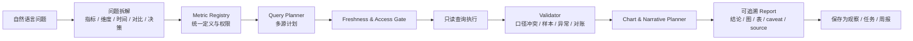

当前 `vkpi_intelligent.py` 先跑固定 intent；只要问题同时含 KOL、内容、曝光、互动，就会优先命中 `kol_content_roi`，综合分析分支甚至不会执行。应改为：

1. 先把问题拆成 1-6 个可验证子问题，而不是先选一个固定答案模板；
2. 从统一 Metric Registry 获取定义、维度、时间窗口和权限；
3. 生成多查询计划，逐项标注表、过滤、预期输出和失败降级；
4. Validator 对 Dashboard、Report、Pool 和历史快照做自动对账；
5. 只有通过校验的数据才进入结论，冲突必须在报告中显式展示；
6. 输出不仅是文字，还包含原生图表、明细表、source date、SQL/查询说明、置信度和限制；
7. 用户可将结果保存成持续观察、任务或固定周报，后续数据变化自动续写，而不是每次重新问。

### 1.8 成员互动：不要复制一个聊天软件，要建立“围绕工作对象的协作层”

当前团队层主要是成员目录、查看身份和零散 `@提及`；普通成员分支有提及入口，Admin 分支反而主要是“查看为”，形成权限与互动不对称。建议所有 Project、KOL、Event、Signal、Action 使用同一个协作对象：

```text
work_item_id / entity_ref
owner / collaborators / watchers
status / priority / due_at / SLA
thread / @mentions / decision_log
handoff_from / handoff_to / accepted_at
evidence_refs / blockers / next_action
activity_log / outcome_ref
```

成员互动第一版只做六件事：评论与 @提及、明确 owner、截止时间、阻塞原因、交接/接管、活动时间线。每次互动都必须依附工作对象并能进入 Unified Work Queue。等这些事件真实积累后，再画成员负载、响应时长、逾期率和交接成功率；当前 `last_active_at` 全空，不能先做“成员效率排行榜”。

---

## 2. 完整系统页面与功能地图

当前主壳有 **21 个可达板块**，另有 8 个 V2 折叠占位项。以下不是按页面好不好看打分，而是看它是否为全局大智能体提供事实、决策、执行或结果。

| 分组 | 页面 | 主要功能 | 当前成熟度 | 与大智能体的关系 | 最大缺口 |
|---|---|---|---|---|---|
| 总览 | Dashboard | KPI、地图、AI Today、趋势、事件、任务 | 部分可用 | 应是监督总览 | 数据源多为空；“下一步”没有统一进入工作队列 |
| 达人运营 | MY KOL | 团队责任人、官号矩阵、收藏 KOL、贡献与风险 | 部分可用 | 提供 ownership 和日常管理状态 | 官号新鲜度不足；部分人员展示存在 fallback 逻辑 |
| 达人运营 | KOL Pool | URL 建档、语义找人、筛选、视频深析入口 | 较强 | 感知和候选供给入口 | 与履约监督、结果学习仍弱连接 |
| 达人运营 | KOL 档案 | 身份、内容、受众、商业、信用、深析、评论 | 较强 | 形成单 KOL 世界模型 | 多块独立请求；缺少“当前应该做什么”的监督结论 |
| 增长渠道 | Projects | 阶段、KOL、物流、证据、成本、提醒 | 较强但口径混杂 | KOL 执行主链之一 | 大量历史 Excel 状态；系统确认和证据确认未完全分开 |
| 增长渠道 | Events | 活动、人员、库存、预算、任务、复盘 | 部分可用 | 线下执行场景 | 当前 DB event task/evidence/retrospective 为空；权限和空态割裂 |
| 增长渠道 | Shopify | GOAFFPRO、短链、优惠码、归因、旧 Shopify | 迁移中 | 最终商业结果 | 新旧链并存；订单和联盟销售当前均为 0 |
| 增长渠道 | Dealers | 经销商地图与渠道覆盖 | 早期 | 渠道世界状态 | 当前 Dealer 数据为 0，无法进入策略闭环 |
| 智能中枢 | Intelligent 问答 | 意图秒回、池内检索、LLM 综合 | 可演示 | 查询/解释接口 | 全只读，且与顶栏全局搜索重复；不能监督和持续追踪 |
| 智能中枢 | 市场之声 | 抱怨、愿望、需求空白、产品建议 | 部分可用 | 外部感知 | 主要是 lexicon_v0 规则；新鲜信号不足，未自动转行动 |
| 智能中枢 | SKU 360° | 产品内容、KOL 匹配、评论、B&H 反馈 | 部分可用 | 产品上下文 | 应是大智能体的一类实体视图，而非主流程中心 |
| 智能中枢 | 创意资产库 | 视频段级素材、拍法、焦段与证据检索 | 部分可用 | 内容记忆与复用 | 搜索和资产展示存在，但未连接执行 brief 与结果表现 |
| 自动化 | 回复队列 | 评论线索、草稿、回复 | 低活跃 | 可执行动作队列 | 132 条中 pending 130、replied 1，生产线未跑起来 |
| 自动化 | 发射台 | KOL 名单、预算、排期、打法、官号协同、预测 | 部分可用 | 组合计划生成器 | 更像规则式六输出，不是动态约束规划器 |
| 自动化 | 自治驾照 | L0-L4、升级/降级、预测命中率门槛 | 结构就绪 | 权限治理 | prediction eval 仍不足；不应据此扩大权限 |
| 自动化 | 战略台 | 行业对照、赛道、预算模拟、策略表现 | 部分可用 | 组合决策 | 4 个面板各自取数，缺统一结论、冲突解释和后续任务 |
| 自动化 | GTM Command | 产品×市场×KOL×渠道路线、预览、行动物化 | 部分可用 | 战略到行动桥 | 当前主要是只读预览；逐条执行仍回 Action Inbox，结果为 0 |
| 智能运维 | 运维 Triage | 数据质量、失败任务、重检/补证据记录 | 部分可用 | 系统自我修复入口 | 目前多为“记录请求”，不是自动修复工作流 |
| 智能运维 | 问数 | 预置查询、只读问数、导出 | 可用 | 事实查询 | 与 Agent 的统一 evidence contract 未完全合并 |
| 智能运维 | 市场趋势 | 观察市场变化 | 部分可用 | 感知 | 观察与 action/outcome 之间缺闭环 |
| 智能运维 | Skill Studio | Skill 版本、运行、评分与结果 | 结构就绪 | Agent 能力治理 | 228 条 skill run 中大量是 test skill；真实业务 skill 规模小 |
| 全局壳 | 搜索、任务中心、通知、设置、权限、主题 | 跨页操作 | 部分可用 | 应承载大智能体 | 搜索与 Intelligent 重复；任务状态分散；主题仍有页面级硬编码 |

折叠 V2 的 Intelligence、Campaigns、Attribution、Analytics、Reports、Signals、Agents、P15 Warehouse 目前不应计入完成度。尤其 **Agents 不应该继续做成孤立页面**，而应吸收到全局 Agent Shell。

---

## 3. 大智能体深度评估

### 3.1 当前真实形态

代码已经有以下骨架：

- `event_ledger`：事实和 trace；
- `workflow_engine`：step、checkpoint、resume；
- `Action Inbox`：建议、审批、执行合约；
- `autonomy_license`：自治边界；
- `memory_entities/facts/links`：长期记忆；
- `learning_loop/evals`：学习与评估；
- `tool_registry/capabilities`：能力清单；
- `Intelligent/GTM/Strategy/Launchpad`：多个决策入口。

但它们尚未组成一个持续运行的大脑。

### 3.2 六层能力评分

| 层 | 评分 | 当前事实 | 判断 |
|---|---:|---|---|
| 感知 | **55** | 328 event、1,222 KOL、2,717 视频证据、广泛业务表 | 数据面宽，但 provenance coverage 为 0，新鲜信号为 0 |
| 记忆 | **52** | 2,966 entity、15,660 facts、4,697 links | 存储规模已成形，但真实反馈只有 12 条且全部 open |
| 规划 | **25** | 15 个 plan，全部 `planned`；planner 为确定性关键词规则 | 不是基于全系统状态、约束和目标的动态规划 |
| 执行 | **45** | 291 Action、13 executed、35 ledger；workflow 支持 checkpoint | 安全治理好，执行转化约 4.5%，worker 当前离线 |
| 监督 | **32** | 有任务中心、Triage、提醒、SLA 零件 | 没有持续扫描“谁、什么、何时、卡在哪”的 KOL supervisor |
| 学习 | **18** | 796 recommendation outcome，但带真实业务 label 为 0；真实 nondemo feedback 为 0 | 不能证明策略因结果而变聪明 |

这个六层评分约为 38/100。它与代码内 54.8 的 Marketing Brain 分数不矛盾：54.8 衡量的是“能力栈是否存在并最近活跃”，38 衡量的是“是否已经像一个智能监督者一样推理和自我改进”。

### 3.3 为什么现在还不聪明

1. **Planner 是固定链。** `orchestrator.py` 的 `_plan_steps()` 基本固定为 `search_kol → scan_profile → optional outreach → create_project_draft`，不能理解 Events、库存、回复队列、预算、交付、内容和归因之间的依赖。
2. **能力清单与可执行工具不一致。** `capabilities.py` 声明 24 项能力、23 项 ready；`tool_registry.py` 真正可编排的只有 8 个工具。
3. **Agent Loop 是 demo loop。** `loop_runner.py` 明确以 dry-run 串通六步，真实执行只放行零副作用白名单；它证明管道存在，不证明业务智能。
4. **世界状态不是统一对象。** 各页面和各 service 自己取数、自己判空，没有一个可版本化的 `WorldStateSnapshot`。
5. **评估缺乏区分度。** 当前 `vkpi_agent_outcome_evaluations=98` 且全部 success，不能用来训练或升级自治；其中还可能混有测试留痕。
6. **学习样本没有业务标签。** 推荐 outcome 有 796 条，但 shortlist/publish/order/ROI 等真实 label 仍为空。

### 3.4 应该怎样让它真正变聪明

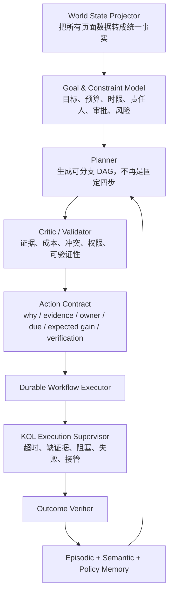

必须新增或统一的核心能力：

1. **World State Projector**：把 KOL、项目、活动、内容、订单、任务、预算和渠道统一成带时间戳与 provenance 的事实。
2. **Goal/Constraint Model**：明确目标、截止日期、预算、人、风险、审批和成功条件。
3. **Planner v2**：输出可分支 DAG；每步带输入、依赖、owner、due_at、cost、fallback、verification。
4. **Critic**：计划落地前检测数据过期、重复动作、预算冲突、证据不足和权限越界。
5. **KOL Execution Supervisor**：持续扫描承诺与现实差异，不等用户打开某页才发现问题。
6. **Outcome Verifier**：自动检查发货、签收、内容链接、发布时间、素材、归因和 ROI。
7. **Learning Policy**：只从有真实标签和可追溯来源的结果中学习；测试数据与生产结果物理隔离。

---

## 4. KOL 执行监督：应成为大智能体第一条真主链

当前 SKU 录入和许多 Project 状态只是已有工作的数字化延续。真正有增量价值的是：系统能否防止 KOL 执行遗漏，并提前干预。

每个 KOL commitment 应统一成：

```text
commitment_id
kol_id / project_id / event_id
commitment_type
owner_staff_id
promised_at / due_at
current_state
required_evidence
blocker_code
next_best_action
escalation_policy
verification_status
outcome_label
```

Supervisor 每 5-15 分钟只做四件事：

1. 发现到期、超期、状态矛盾和证据缺失；
2. 计算影响与优先级；
3. 生成可执行 action contract，低风险自动推进，高风险进入人审；
4. 验证结果并回写记忆。

第一批监督规则应该覆盖：

- 候选确认后 N 小时未分配 owner；
- outreach 草稿已生成但未发出；
- 合作确认后未建 shipment；
- tracking placeholder 超过阈值；
- 签收后未开启 observation window；
- 承诺发布日期前 72/24 小时无素材/无确认；
- 内容已发布但缺 URL、证据、评论采集或归因；
- 队列 failed/blocked 超过重试或 SLA；
- 回复队列高意向评论超时；
- 结果未进入 outcome/eval，导致学习断链。

---

## 5. UI/UX 全系统审计

### 5.1 核心结论

当前 UI 最大问题不是单页面不够漂亮，而是：

- 21 个页面按模块组织，用户要自己把任务串起来；
- 同一种“下一步”分散在 AI Today、Action Inbox、任务中心、回复队列、GTM、战略台、Triage；
- Intelligent 同时有顶栏 Overlay 和独立页面；
- 页面切换会卸载/重挂页面，多个页面自取数据；
- 主题、空态、权限和数据新鲜度的表达不一致；
- 大智能体没有当前页面、当前实体、当前筛选的上下文。

### 5.2 原型对照证据（真实 Admin 证据见 1.4）

以下截图保留用于核对同一构建的信息架构；本轮真实 Admin 页面和数据结论以前文 1.4 及 `admin_live_audit/` 为准。

#### 1. Dashboard — **At risk**

- 1272×720 下测得 632 个 DOM 节点、56 个按钮、65 个 SVG、58 个带 transition/animation 的元素。
- 页面高度 1,722px；核心“地图”占据首屏大面积，但业务状态为空时仍然保留完整空间。
- Dashboard bundle 并发 10 个 API，最重 summary timeout 设为 10 秒。

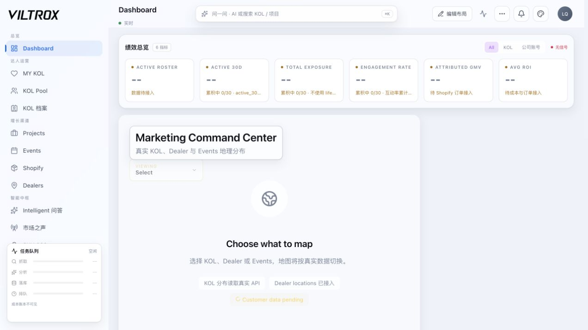

#### 2. KOL Pool — **结构较好，但未成为执行监督入口**

- URL、建档、分析、召回和筛选被收进一个入口，这是正确方向。
- 但页面关注“找谁”，没有把跨 Project/Event 的承诺、风险和结果直接并入同一个 KOL 工作视图。


#### 3. Intelligent — **Broken product model**

- 页面只有一个独立问答框，和顶栏 `AskCommandOverlay` 重复。
- 它是 read-only 问答，不会建立持续任务、监督进度或记住用户的行动承诺。
- 大面积空白说明它更像功能 demo，而不是全系统智能层。

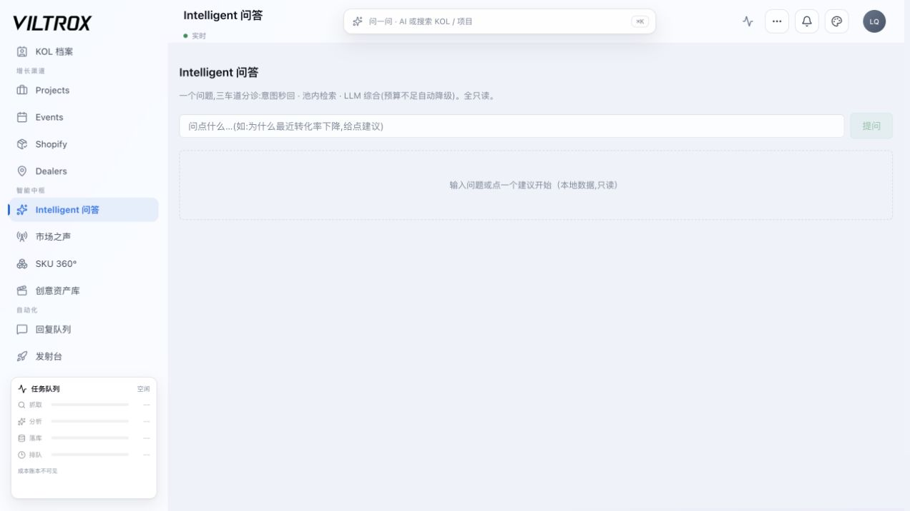

#### 4. Events — **At risk**

- 权限告警、0 数据 KPI、新建按钮同时出现，用户不知道是没权限、没数据还是功能未接好。
- `EventsMockupPage` 仍硬编码深色背景和白字，而壳层已经有统一 ThemeProvider，存在主题漂移风险。

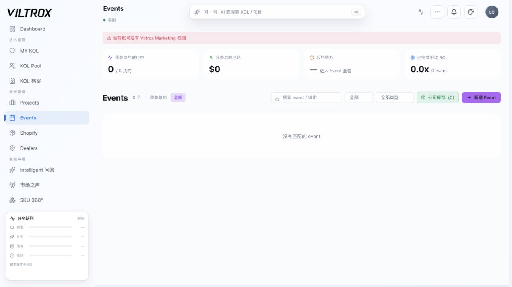

#### 5. Shopify — **At risk**

- GOAFFPRO 迁移、设置入口、退役短链和 Legacy Shopify 同时出现，信息架构主要在解释迁移历史，而不是展示商业结果。
- 当前没有订单，Agent 无法验证推荐带来的 GMV/ROI。

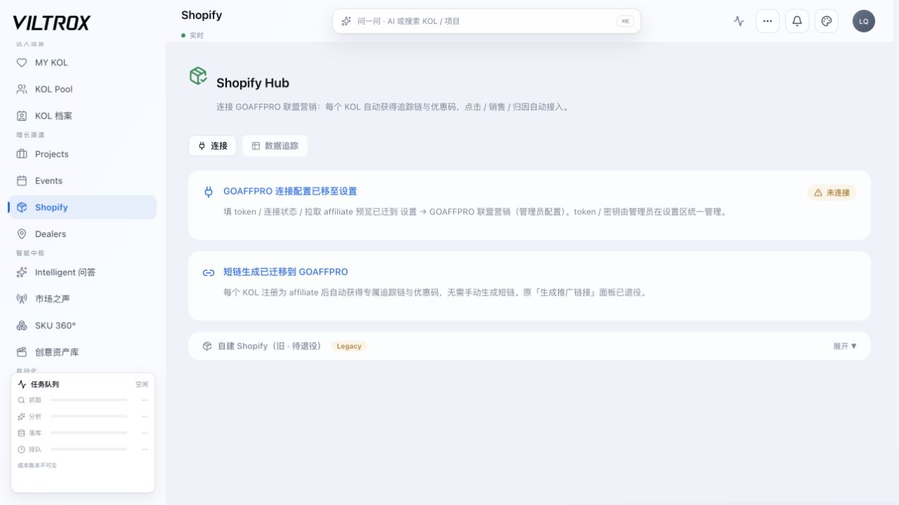

#### 6. Autonomy / GTM — **结构存在，业务反馈不足**

- 自治驾照以预测命中率升级，但当前 eval 样本和结果标签不足。
- GTM Command 仍以 SKU 搜索和预览为主；没有形成跨页面的持续监督计划。

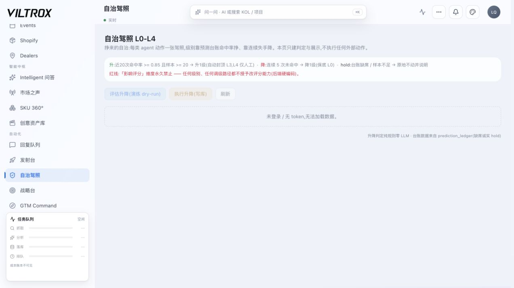

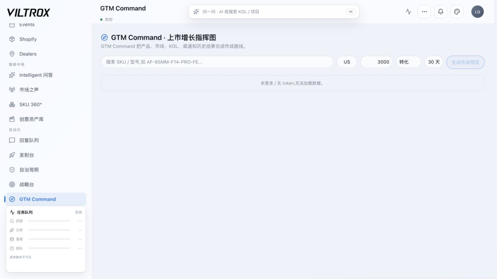

### 5.3 应有的统一 Agent Shell

不新增页面，在现有壳层加入一个可收起的全局 Agent Dock：

| 区域 | 展示内容 | 用户价值 |
|---|---|---|
| Now | 当前最重要的 3-5 件事 | 不用在 21 页找任务 |
| Context | 当前页面、实体、筛选、角色、数据新鲜度 | Agent 真正理解用户正在看什么 |
| Why | 结论、证据、置信度、反证 | 可解释，不是神谕 |
| Plan | 步骤、owner、deadline、成本、依赖 | 计划可审阅 |
| Run | 审批、执行、重试、人工接管 | 从建议走到落实 |
| Verify | before/after、证据、结果、ROI | 证明完成 |
| Memory | 这次学到了什么、下次如何调整 | 形成成长性 |

现有顶栏 `AskCommandOverlay` 可以升级为 Agent Shell 的轻入口，独立 Intelligent 页面应降级为“历史会话/分析工作台”或被合并。

---

## 6. 卡顿与不顺畅的代码级根因

### 6.1 冷启动请求风暴

`useCockpitRuntime()` 在 Cockpit 壳挂载时，不看当前 `activeNav` 就会：

- 拉 shell bundle：2 个请求；
- 拉 Dashboard bundle：10 个请求；
- 分页拉全量 KOL workspace：当前 1,222 行需要 2 个请求，最多可到 8 个；
- CockpitApp 和团队层还会补充 health/presence/group 等请求；不同页面版本略有差异。

因此当前数据规模下，用户打开 **任意一个页面**，冷缓存基础负载至少约为 **15 个请求**，还没算当前页面自己的请求。KOL 档案、战略台等页面再并发自己的多个 panel。当前虽已有 IndexedDB/resource cache 与 idle refresh，但它降低的是重复代价，没有消除架构性 overfetch。

### 6.2 包体与样式

- 当前 dist 有 66 个 JS chunk，最大 **595.7KB**，刚好低于 600KB 门限，静态 import 图无环。
- 全部 JS/CSS gzip 总量约 **1.10MB**；这不是首屏必下的精确值，但说明总体交付面已大。
- 最大 CSS asset 约 202KB；新 `cockpit-reference.css` 源文件 **2,334 行**。
- `CockpitApp.tsx` 仍同步 import KOL Pool、Shopify、Dealer、Dashboard、地图与 Framer Motion `domMax`；只有部分页面 lazy。
- `EventsMockupPage`、大量 `text-white/bg-black` 与全局主题并存，增加主题重绘和视觉漂移。

### 6.3 渲染与状态

- 每次切页使用 `AnimatePresence mode="wait"`，整页 exit 后再 enter，固定增加约 180ms 感知延迟。
- 页面按 `activeNav` 条件卸载；重进时多数页面重新执行 effect，缓存策略不统一。
- Strategy Board 的 4 个 panel、KOL Profile 的多个 block 各自取数，缺少 page bundle 和 request coalescing。
- 多套任务/刷新机制共存：SSE、5s/10s polling、60s presence、页面级 interval；缺一个全局订阅与可见性预算。
- `TaskProgressBoard` 即使收到共享 stream 也会无条件创建本地 `useWorkflowRunsStream`；当前引用较少，但这是重复轮询的明确隐患。

### 6.4 性能优化顺序

1. **先做 page-scoped data loading**：只加载当前页面必需数据；Dashboard/KOL 预取放到 idle 且有预算。
2. **做 Global Query Cache**：统一 dedupe、TTL、stale-while-revalidate、abort、visibility pause。
3. **壳层只保留 2-4 个请求**：session、权限/导航、任务摘要、agent now；其它按需。
4. **把 KOL 全量数据改成服务端分页/虚拟列表**，壳层不再常驻 1,222+ 行。
5. **把 Dashboard 10 请求合成 2-3 个版本化 bundle**，并给 source health 单独返回。
6. **移除整页 mode=wait**，只对局部 skeleton/关键状态做轻动画；尊重 reduced motion。
7. **继续分包**：地图、Three、Leaflet、报表、重型抽屉按路由/交互 lazy。
8. **拆 2,334 行 CSS** 为 tokens、shell、page、component、theme，并清除 hard-coded color。
9. **加 RUM**：p75 page-ready、INP、long task、请求数、重复请求、API p95、页面内存。

性能验收目标：

| KPI | 30 天目标 |
|---|---:|
| 冷启动壳层请求 | ≤ 4 |
| 页面额外请求 | 普通页 ≤ 4；复杂页 ≤ 8 |
| p75 首屏可操作 | ≤ 1.8s（公司网络） |
| p75 页面切换可操作 | ≤ 350ms |
| p75 INP | ≤ 180ms |
| 50ms+ long task | 每次导航 ≤ 2 个 |
| 重复 GET | 0 |
| 单 JS chunk | 建议降到 ≤ 450KB，硬门仍 600KB |

---

## 7. 内部 KPI 系统应该怎样定义

### 7.1 北极星

> **KOL 承诺按期证据闭环率** = 在承诺时间内完成、且证据验证合格的 KOL 执行项 / 到期 KOL 执行项

它比“录入多少 SKU”“创建多少 Project”“Agent 产生多少建议”更接近实际价值。

### 7.2 大智能体 KPI

| KPI | 定义 | 当前基线 | 建议目标 |
|---|---|---:|---:|
| 事实新鲜覆盖率 | SLA 内更新的关键事实 / 关键事实 | 市场新鲜信号 0；官号陈旧 | ≥95% |
| 风险提前发现率 | 人工发现前被 Agent 命中的风险 / 全部确认风险 | 待埋点 | ≥80% |
| 有效建议率 | 被接受且最终验证有效 / 建议 | 当前无法可靠算 | ≥60% |
| 建议执行转化 | executed / Action Inbox | 13/291 ≈ 4.5% | 30 天 ≥25% |
| 计划完成率 | completed workflow / started | 历史 21/21；近 7 天 0 run | 近 7 天 ≥90% 且 ≥20 run |
| Action→Outcome 连接率 | 有验证 outcome 的已执行 action / 已执行 action | 口径不完整 | ≥95% |
| 真实反馈量 | 排除 demo/test 的人工反馈 | 0 | 每周 ≥20 |
| 人工推翻率 | 被拒绝/修改的 Agent 决策 / 人审决策 | 待埋点 | 初期允许高，稳定后 <20% |
| 自动动作回滚率 | 被回滚自动动作 / 自动动作 | 待埋点 | <2% |
| 单次有效闭环成本 | AI+provider 成本 / 已验证成功闭环 | 待埋点 | 按动作族设预算 |
| 学习提升 | 新策略相对基线的 outcome lift | 当前无标签 | 连续 4 周正向 |

### 7.3 绝不能作为北极星的指标

- 生成建议数量；
- Agent 调用次数；
- 页面数量；
- SKU 录入数量；
- 导入 assignment 数；
- 没有 evidence/outcome 的“完成状态”；
- 只看测试通过数，不看运行与业务闭环。

---

## 8. 优化路线图

### P0：0-2 周，先让系统轻、真、统一

1. 修复登录和 worker，恢复新鲜数据与 7 天 workflow 活跃度。
2. 把全局冷启动从约 18 个基础请求降到 4 个以内。
3. 建立统一 `AgentContextProvider`：page、entity、selection、filter、role、source freshness。
4. 把 AI Today、Action Inbox、任务中心、Reply Queue、Triage 合成一个 `Unified Work Queue`。
5. 定义 KOL commitment 与 Supervisor 规则，先只读观察和建议。
6. 为所有 action 增加 owner、due_at、expected_gain、evidence、verification。
7. 生产数据、测试数据和 demo loop 留痕分离。

### P1：2-6 周，形成一个真正的大智能体

1. 建 `WorldStateSnapshot` 和页面事实投影器。
2. Planner v2 输出动态 DAG，不再固定四步。
3. 增加 Critic：新鲜度、证据、预算、冲突、重复、权限检查。
4. 将 KOL 执行监督接入 Durable Workflow；每步可恢复、可接管、可验证。
5. 将 Intelligent 合并进全局 Agent Shell，保留历史与深度分析，不再双入口竞争。
6. 统一跨页导航和 deep-link；任务直接打开正确实体与上下文。
7. 拆分重型 chunk/CSS，统一主题和 skeleton。

### P2：6-12 周，开始让它通过结果变聪明

1. 发布、回复、订单、ROI、素材表现进入 outcome label。
2. 建真实 eval set：成功、失败、人工推翻、延迟、成本、风险。
3. 用 shadow mode 对比 rule planner 与 planner v2。
4. 只有连续达标的动作族才从 L1 升 L2/L3。
5. 给每个页面增加“Agent 看到了什么 / 为什么 / 下一步 / 是否已验证”。
6. 形成周度策略回顾：哪些判断有效、哪些失败、规则如何调整。

### P3：3-6 个月，平台化

- 组织隔离和逐表 tenantization；
- 可配置 commitment/workflow/action policy；
- Agent skill marketplace 之前先做正式 skill contract；
- 可靠性 SLO、成本预算、审计导出、客户支持；
- 用真实 uplift 而不是 demo 数量证明商业价值。

---

## 9. 最终优先级

如果只能做三件事：

1. **做全局 KOL Execution Supervisor，而不是再做页面。**
2. **把壳层数据加载和统一任务队列重构掉，先解决卡顿和信息分裂。**
3. **把执行结果变成真实学习标签，停止用 demo/test success 证明智能。**

系统最有价值的未来不是“功能更多”，而是：团队打开任何页面时，大智能体都知道当前上下文、真正的阻塞、谁该做什么、什么时候必须完成，以及完成后是否产生了业务结果。

---

## 10. 关键证据索引

- 固定规则 planner：`backend/app/domains/agents/orchestrator.py`
- demo loop：`backend/app/domains/agents/loop_runner.py`
- 8 项可执行工具：`backend/app/domains/agents/tool_registry.py`
- 24 项能力清单：`backend/app/domains/agents/capabilities.py`
- Marketing Brain 评分卡：`backend/app/domains/intelligence/marketing_brain_scorecard.py`
- Durable Workflow：`backend/app/domains/platform/workflow_engine.py`
- 壳层与路由：`frontend/src/components/vkpi/cockpit/CockpitApp.tsx`
- 冷启动全量 KOL/Dashboard：`frontend/src/components/vkpi/cockpit/useCockpitRuntime.ts`
- Dashboard 10 请求：`frontend/src/components/vkpi/cockpit/api.ts`
- 导航 21 页 + V2：`frontend/src/components/vkpi/cockpit/data/navItems.ts`
- 独立问答页：`frontend/src/components/vkpi/cockpit/pages/IntelligentPage.tsx`
- 顶栏问答/全局搜索：`frontend/src/components/vkpi/cockpit/components/AskCommandOverlay.tsx`
- Events 主题硬编码：`frontend/src/components/vkpi/pages/events/EventsMockupPage.tsx`
- 重复 stream 隐患：`frontend/src/components/vkpi/cockpit/components/TaskProgressBoard.tsx`
- Intelligent 固定意图抢占综合分析：`backend/app/api/routers/vkpi_intelligent.py`
- 报告重新拼装全量 KOL 与 Dashboard 指标：`frontend/src/components/vkpi/cockpit/lib/reportRuntime.ts`
- 报告入口与数据注入：`frontend/src/components/vkpi/cockpit/CockpitApp.tsx`
- Admin/成员互动分支差异：`frontend/src/components/vkpi/cockpit/TeamModal.tsx`
- Admin 实机审计快照：`admin_live_audit/audit_snapshot.json`
- 可复跑数据附录：`admin_live_audit/vkpi_admin_full_system_audit.ipynb`
