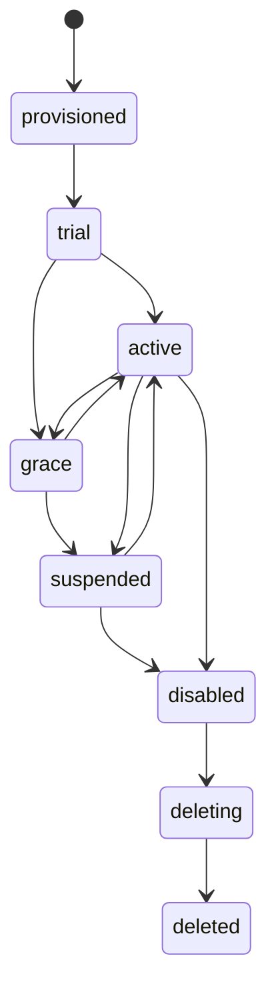

# 01｜产品架构与信息架构

## 1. 产品目标

把当前 V-KPI 从单一公司内部系统演进为一套行业无关的企业 AI 应用平台。平台核心负责公司、身份、授权、计量、运行和审计；业务模块负责行业数据、页面、智能体和工作流。

目标不是“做一个更大的后台”，而是让每一层只管理自己拥有的权力，并能清楚回答：谁、在什么公司、依据什么套餐和策略、对什么资源、做了什么、消耗多少、结果如何、能否撤销。

## 2. 三层控制台职责

### 2.1 母控制台

服务对象：平台 Owner、平台运营、计费管理员、安全审计员、支持工程师、发布管理员。

核心职责：

- 公司开通、试用、宽限、暂停、恢复、停用、删除。
- 套餐、模块、席位、配额、超额策略和商务备注。
- 租户 Owner/管理员首配、身份源和权限边界。
- 数据驻留区域、共享/专属部署、存储和队列归属。
- 模型目录、供应商账户、租户模型绑定、路由和降级。
- Feature Flag、发布渠道、灰度、回滚和运行监控。
- 全局/租户级用量与成本，不默认查看业务内容。
- 全局审计、支持访问申请、紧急授权和事件处置。

母控制台不是租户业务后台。平台员工若需进入租户界面，只能通过“代表租户查看”的限时授权会话，页面持续显示醒目标识。

### 2.2 公司管理控制台

服务对象：公司 Owner、公司管理员、部门管理员、项目管理员、财务观察员、公司审计员。

核心职责：

- 公司资料、域名、身份登录、安全策略和默认设置。
- 部门、成员、群组、角色、服务账号和离职交接。
- 项目、数据范围、共享策略、敏感数据规则。
- 企业知识空间、数据源、索引状态、保留和访问范围。
- 智能体、版本、模型绑定、工具权限、提示词和发布范围。
- 工作流、审批节点、触发器、运行权限和失败处理。
- 公司配额、预算、用量分摊、内部告警和审计。

公司管理员只能在平台已经授予的模块、区域、模型和总配额内做更细配置。

### 2.3 用户控制台

服务对象：普通成员、项目成员、分析人员、个人管理者。

核心职责：

- 我的任务、待审批、项目、收藏、最近数据和运行进度。
- AI 助手对话、来源、行动草稿、个人记忆和偏好。
- 个人通知渠道、免打扰、授权记录、会话和设备。
- 我的用量、配额剩余、费用归属、导出和删除申请。
- 多公司用户的显式工作区切换。

个人设置可以收紧体验，例如关闭记忆或通知；不能扩大套餐、角色或数据范围。

## 3. 角色目录

### 3.1 平台角色

| 角色 | 主要权力 | 明确禁止 |
|---|---|---|
| `platform_owner` | 平台治理、角色委派、关键审批 | 日常使用共享超管账号 |
| `platform_operator` | 公司生命周期、套餐实施、运行查看 | 读取租户业务正文、查看完整密钥 |
| `billing_admin` | 套餐、订阅、账单、信用额度、退款流程 | 修改人员权限和租户业务数据 |
| `security_auditor` | 审计、访问复核、安全导出 | 修改业务配置、启动任务 |
| `support_engineer` | 健康诊断、申请限时支持访问 | 无授权进入租户、导出客户数据 |
| `release_manager` | 版本、灰度、回滚、维护窗口 | 修改套餐、成员或业务内容 |

### 3.2 公司角色

| 角色 | 默认范围 |
|---|---|
| `tenant_owner` | 公司全部管理能力，关键动作仍需二次确认/双人审批 |
| `tenant_admin` | 人员、项目、知识、智能体、工作流和公司设置 |
| `department_admin` | 指定部门及下属项目，不可管理其他部门 |
| `project_manager` | 指定项目成员、数据、工作流和预算子额度 |
| `operator` | 获授权项目中的创建、运行和编辑 |
| `viewer` | 获授权范围内只读 |
| `finance_viewer` | 公司用量、成本中心、账单只读 |
| `tenant_auditor` | 公司审计只读与合规导出 |

系统预置角色不可直接改写权限清单；可复制为自定义角色。`tenant_owner` 至少保留一名，最后一名 Owner 不可删除或降级。

## 4. 信息架构

### 4.1 母控制台导航

| 一级导航 | 二级页面 | 优先级 |
|---|---|---|
| 总览 | 平台健康、租户状态、收入/用量、告警、发布状态 | P0 |
| 公司 | 公司列表、开通向导、公司详情、生命周期、管理员 | P0 |
| 商业 | 套餐、模块、订阅、配额模板、账单与信用额度 | P0/P1 |
| AI 与供应商 | 供应商、密钥版本、模型目录、模型绑定、路由策略 | P0 |
| 部署 | 区域、租户部署、发布渠道、版本、维护窗口 | P0 |
| 控制 | Feature Flag、限流、预算保护、全局降级 | P0 |
| 可观测性 | 服务、队列、任务、成本、SLO、告警和事件 | P0 |
| 安全 | 平台人员、平台角色、支持访问、紧急授权 | P0 |
| 审计 | 全局审计、敏感访问、策略变化、导出记录 | P0 |

### 4.2 公司管理控制台导航

| 一级导航 | 二级页面 | 优先级 |
|---|---|---|
| 公司概览 | 成员、项目、用量、风险、待办 | P0 |
| 组织 | 部门、成员、群组、角色、邀请、服务账号 | P0 |
| 数据权限 | 资源范围、项目策略、共享规则、数据分类 | P0 |
| 项目 | 项目模板、项目成员、归档和所有权交接 | P0 |
| 知识 | 知识空间、来源、同步、索引、访问范围 | P1 |
| 智能体 | 智能体、版本、模型、工具、发布和评测 | P1 |
| 工作流 | 定义、版本、触发器、审批、运行和失败队列 | P1 |
| 用量与预算 | 部门/项目用量、子配额、告警、成本中心 | P0/P1 |
| 安全 | 登录、会话、域名、保留、导出、删除策略 | P0 |
| 公司审计 | 人员、权限、数据、AI、工作流和导出事件 | P0 |

### 4.3 用户控制台导航

| 一级导航 | 二级页面 | 优先级 |
|---|---|---|
| 首页 | 今日任务、待审批、运行中、告警、最近项目 | P0 |
| 我的任务 | 收件箱、我创建、我负责、自动化任务、历史 | P0 |
| 我的项目 | 参与项目、收藏、最近访问、共享给我 | P0 |
| 我的数据 | 保存查询、导出、数据集、来源与权限说明 | P1 |
| AI 助手 | 对话、来源、行动草稿、运行过程、反馈 | P0 |
| 我的记忆 | 候选记忆、已确认事实、暂停、导出、删除 | P0 |
| 通知 | 站内、邮件、Webhook/IM、免打扰、摘要 | P1 |
| 授权与安全 | 角色、项目授权、第三方连接、会话、设备 | P0 |
| 我的用量 | 查询、Token、任务、抓取、存储、配额余额 | P1 |
| 偏好 | 语言、时区、显示、默认模型、辅助功能 | P1 |

## 5. 跨层控制顺序

一次请求按以下顺序评估，任一步失败立即拒绝并返回可解释原因：

控制配置采用分层解析：

`平台安全硬限制 > 区域/合规限制 > 套餐授权 > 公司策略 > 部门/项目策略 > 个人偏好`。

个人偏好只能影响允许范围内的默认行为；公司策略不能突破套餐；平台运营也不能通过普通配置突破合规硬限制。

## 6. 公司生命周期

### 6.1 状态机

| 状态 | 登录 | 读取 | 新增/修改 | 后台任务/AI 消耗 | 导出 |
|---|---|---|---|---|---|
| `provisioned` | 仅首位 Owner | 初始化页 | 仅初始化 | 禁止 | 禁止 |
| `trial` | 允许 | 允许 | 套餐范围内 | 试用额度内 | 按策略 |
| `active` | 允许 | 允许 | 允许 | 允许 | 允许 |
| `grace` | 允许 | 允许 | 限制新增资源 | 限额/降级 | 允许 |
| `suspended` | 管理员有限登录 | 只读 | 禁止 | 停止新任务，运行中安全终止 | 合规窗口内允许 |
| `disabled` | 禁止，平台救援除外 | 禁止 | 禁止 | 全停 | 仅经审批 |
| `deleting` | 禁止 | 禁止 | 禁止 | 全停 | 删除前最终导出流程 |
| `deleted` | 禁止 | 不可用 | 不可用 | 不可用 | 不可用 |

暂停和停用不是删除。停用必须撤销会话、API Token、Webhook、计划任务和供应商路由；删除必须经过保留期、法律保留检查、备份过期和可验证清除。

### 6.2 开通向导

1. 创建公司草稿并生成不可变 `organization_uid`。
2. 选择套餐、模块、席位、用量和超额策略。
3. 选择数据区域、部署模式和发布渠道。
4. 配置模型供应商路由；默认只选平台审核目录。
5. 创建首位 Owner，完成邮箱/域名验证与 MFA。
6. 执行数据库、存储、队列、密钥和健康检查。
7. 生成开通预览，显示所有实际授权和预计成本。
8. 双人批准后激活，并向 Owner 发送一次性初始化链接。
9. 保存开通回执和全链路审计事件。

开通流程必须是可恢复的状态机，每一步幂等，失败可重试或补偿，不能用一个长事务假装原子完成所有外部资源创建。

## 7. 业务模块化

### 7.1 平台核心模块

- Identity：用户、组织成员、会话、身份源、MFA。
- Policy：角色、策略、关系和决策解释。
- Entitlement：套餐、模块、限额和有效期。
- Metering：不可变用量事件、聚合、预算和账单。
- Runtime：区域、部署、队列、模型和密钥路由。
- Release：版本、渠道、灰度、迁移和回滚。
- Audit：行为、敏感读取、自动决策和访问回执。

### 7.2 业务模块接入状态

模块状态统一为 `draft → validating → approved → published → deprecated → retired`。发布前需通过：

- 权限动作完整性检查。
- 所有租户表的组织范围检查。
- 用量事件覆盖检查。
- 数据导出、删除和保留检查。
- 模型/工具安全与成本上限检查。
- Feature Flag 和回滚检查。
- 浏览器流程、API 合同、跨租户和容量测试。

## 8. 关键用户旅程

### 8.1 新公司首次使用

平台开通 → 公司 Owner 激活 → 配置域名/MFA → 建部门与角色 → 邀请成员 → 建项目 → 授权知识/智能体/工作流 → 设置预算 → 普通用户进入自己的任务工作台。

### 8.2 新模块启用

平台确认套餐变更 → 模块依赖/区域/版本预检 → 公司管理员查看新增权限清单 → 选择试点部门/项目 → 灰度启用 → 观察用量和错误 → 全公司发布或回滚。

### 8.3 员工离职

暂停成员 → 撤销会话/Token → 终止个人自动化 → 交接项目和知识源 → 处理个人记忆（保留、转为企业知识需本人/策略许可、或删除）→ 确认审计 → 删除/匿名化账号。

### 8.4 AI 建议转为行动

用户提问 → 助手展示引用和权限范围 → 生成行动草稿 → 用户确认关键参数 → 若为高风险则提交审批 → 工作流执行 → 记录模型、工具、成本、输入来源和结果 → 用户反馈 → 仅经确认的内容进入长期记忆。

## 9. 产品成功指标

| 维度 | 首发指标 |
|---|---|
| 开通效率 | 标准共享租户 30 分钟内完成开通，人工步骤 ≤2 个 |
| 权限正确性 | 跨租户/越权自动化测试 100% 拒绝；无未知作用域 |
| 管理自助率 | 80% 常规人员、项目、知识和工作流配置无需平台介入 |
| AI 透明度 | 100% AI 运行可追溯到组织、用户、模型、工具、成本和来源 |
| 成本归属 | ≥98% 供应商成本可归属到公司；未归属成本 <2% |
| 变更安全 | P0 控制变更 100% 有审批、预览、回滚和审计回执 |
| 恢复能力 | 关键发布回滚 <10 分钟；达到既定 RTO/RPO |
| 用户信任 | 个人记忆可查看、确认、暂停、导出和删除 |

## 10. 产品决策检查表

新增任何功能前必须回答：

1. 它属于平台、公司还是个人层？
2. 谁拥有数据，`organization_id` 和主体是谁？
3. 套餐如何授权，角色如何授权，数据范围如何限制？
4. 使用哪个区域、模型、供应商和队列？
5. 如何计量、预算、限流和归属成本？
6. 哪些动作需要确认、MFA 或双人审批？
7. 审计记录什么，客户能否查看？
8. 如何关闭、回滚、导出、删除和恢复？
9. 模块被停用后，历史数据和运行中的任务怎么办？
10. 是否有跨租户、并发、失败和降级测试？
