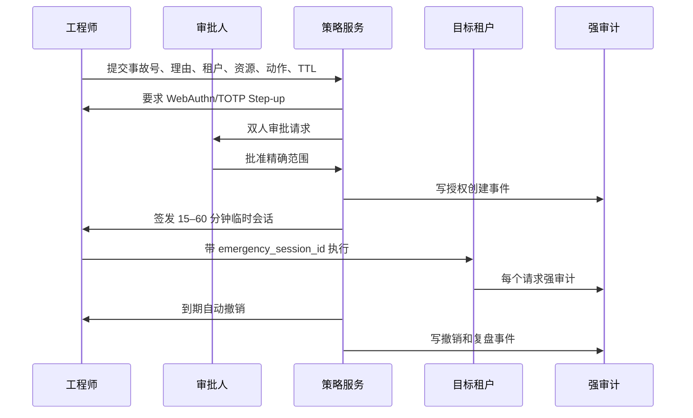

# 02｜身份、权限与租户边界

## 1. 安全目标

权限体系需要同时解决四个问题：

1. **身份是谁**：人、服务账号、系统任务、平台支持人员或紧急会话。
2. **当前在哪家公司**：显式工作区，而不是“找到第一条成员关系”或默认公司 1。
3. **可以买到什么、可以操作什么、可以看到什么**：套餐权益、功能开关、角色权限和数据关系分别判断。
4. **为什么放行或拒绝**：每次决策可解释、可审计、可重放验证。

## 2. 身份与会话模型

### 2.1 主体类型

| 主体 | 用途 | 凭证要求 |
|---|---|---|
| `human_user` | 平台人员、公司成员、普通用户 | OIDC/密码 + MFA 策略，会话可撤销 |
| `service_account` | 企业集成、CI、受控自动化 | 短期 Token/签名密钥，绑定组织和作用域 |
| `workload_identity` | Worker、Scheduler、内部服务 | mTLS/OIDC 工作负载身份，不使用人类 Token |
| `support_session` | 获客户/平台批准的只读支持访问 | 原身份 + 限时委派声明 |
| `emergency_session` | 事故处置的紧急限权访问 | Step-up MFA + 审批 + TTL + 强审计 |

### 2.2 请求上下文

所有 HTTP、SSE、Worker、Scheduler 和 Webhook 处理都必须生成统一上下文：

```text
request_id
actor_type / actor_id
effective_actor_id
organization_id
region_id
environment
session_id
authn_strength
role_binding_version
entitlement_version
policy_version
support_session_id / emergency_session_id（可空）
```

`organization_id` 必须来自已验证会话中的工作区选择或受信工作负载声明。客户端请求体中的组织 ID 只能作为资源定位参数，不能决定授权上下文。

### 2.3 多公司用户切换

- 登录后先列出有效成员关系，用户显式选择工作区。
- 工作区切换重新签发短期访问 Token，包含单一 `organization_id`。
- Token 不允许同时代表多个公司；跨公司聚合只能由专门的平台代理接口完成。
- 切换时清空公司级缓存、查询、路由和前端状态。
- 已暂停公司不出现在可进入列表；离职后的成员关系立即失效。
- 多个成员关系不允许以“第一条记录”自动选择。

## 3. 授权模型：RBAC + ABAC + ReBAC

### 3.1 三种机制的分工

- **RBAC**：角色提供常用动作集合，例如 `project.read`、`member.invite`。
- **ABAC**：根据数据等级、区域、设备、时间、MFA、套餐、预算等属性加限制。
- **ReBAC**：根据用户与资源的关系决定范围，例如项目 Owner、成员、被分享者、部门上级。

一个动作不能只靠前端菜单隐藏或单个 `is_admin` 布尔值授权。

### 3.2 决策公式

```text
ALLOW = account_active
    AND organization_active
    AND entitlement_allows(module, capability)
    AND feature_flag_allows(context)
    AND role_or_policy_allows(action, resource_type)
    AND relation_allows(subject, resource)
    AND data_classification_allows(context)
    AND quota_budget_allows(metric)
    AND risk_control_passed(action)
    AND NOT explicit_deny
```

显式拒绝始终优先。任何依赖不可用、组织上下文缺失、策略版本未知或资源归属不明确，均应失败关闭。

### 3.3 决策服务接口

```json
{
  "subject": {"type": "human_user", "id": "usr_..."},
  "context": {"organization_id": "org_...", "region": "us-east", "authn_strength": "mfa"},
  "action": "project.export",
  "resource": {"type": "project", "id": "prj_..."},
  "input": {"format": "xlsx", "row_estimate": 18000}
}
```

决策响应：

```json
{
  "decision": "deny",
  "reason_code": "STEP_UP_REQUIRED",
  "explanation": "敏感数据批量导出需要重新验证",
  "policy_version": "polv_...",
  "obligations": [{"type": "mfa_step_up"}],
  "decision_id": "pdc_..."
}
```

业务服务执行 `obligations`，例如脱敏字段、加水印、限制行数、要求审批或补写敏感访问日志。

## 4. 权限命名与资源层级

### 4.1 权限命名

统一格式：`<domain>.<resource>.<action>`。

示例：

- `platform.organization.provision`
- `platform.organization.suspend`
- `platform.entitlement.override`
- `platform.release.deploy`
- `tenant.member.invite`
- `tenant.role.assign`
- `project.data.export`
- `knowledge.source.connect`
- `agent.version.publish`
- `workflow.run.approve`
- `personal.memory.delete`

不再把“页面 Tab 是否可见”作为后端权限真源。页面可见性由服务端返回的能力清单派生。

### 4.2 资源层级

```text
platform
└── organization
    ├── department
    │   └── project
    │       ├── dataset
    │       ├── knowledge_space
    │       ├── agent
    │       └── workflow
    └── personal resources (owner = user, organization scoped)
```

授权范围可为 `organization`、`department`、`project`、具体资源或本人。上级角色不会自动跨越显式隔离项目或更高数据等级。

## 5. 平台角色矩阵

符号：A=执行，R=只读，P=可审批，—=无权。

| 能力 | Owner | Operator | Billing | Auditor | Support | Release |
|---|:---:|:---:|:---:|:---:|:---:|:---:|
| 公司开通/暂停 | P/A | A | R | R | R | — |
| 套餐/订阅 | P | R | A | R | — | — |
| 权益临时覆盖 | P | A | P | R | — | — |
| 区域/部署 | P | A | — | R | R | A |
| 供应商/模型策略 | P | A | R | R | R | R |
| 主密钥轮换 | P | — | — | R | — | A（双人） |
| 发布/回滚 | P | R | — | R | R | A |
| 平台审计 | R | 限定 R | 计费 R | A/R | 自身 R | 发布 R |
| 支持访问申请 | R | P | — | R | A | — |
| 紧急授权审批 | P | P | — | R | 申请 | — |
| 租户业务正文 | — | — | — | 默认 — | 授权后限定 R | — |

至少两名不同人员参与以下操作：删除公司、改变数据驻留区域、轮换平台主密钥、关闭审计、全局发布、全局 Feature Flag、跨租户写入、紧急授权写会话。

## 6. 公司角色矩阵

| 能力 | Owner | Admin | Dept Admin | Project Mgr | Operator | Viewer | Finance | Auditor |
|---|:---:|:---:|:---:|:---:|:---:|:---:|:---:|:---:|
| 公司资料/安全策略 | A | A | R | — | — | — | — | R |
| Owner 管理 | P/A | — | — | — | — | — | — | R |
| 成员邀请/停用 | A | A | 部门内 A | 项目邀请 | — | — | — | R |
| 角色创建/绑定 | A | A | 部门内限定 | 项目内限定 | — | — | — | R |
| 项目管理 | A | A | 部门内 A | 指定项目 A | 使用 | R | — | R |
| 数据导出 | 策略内 A | 策略内 A | 部门内 | 项目内 | 需授权 | 需授权 | — | 审计导出 |
| 知识空间 | A | A | 部门内 A | 项目内 A | 使用/贡献 | R | — | R |
| 智能体发布 | P/A | A | 部门内审批 | 项目草稿 | 使用 | 使用 | — | R |
| 工作流发布 | P/A | A | 部门内审批 | 项目草稿 | 运行 | 查看 | — | R |
| 子预算 | A | A | 部门内 | 项目内 | R | — | R | R |
| 公司审计 | R | R | 部门内 R | 项目内 R | 自身 | 自身 | 计费 R | A/R |

矩阵是默认模板，最终由动作、范围和策略计算；不能把它硬编码为大量散落的 `if role == ...`。

## 7. 数据范围规则

### 7.1 项目可见性

项目定义 `private`、`members`、`department`、`organization` 四种可见级别：

- `private`：Owner 与显式成员。
- `members`：项目成员。
- `department`：指定部门成员，敏感数据仍需额外授权。
- `organization`：公司成员可读，写入仍需角色。

项目管理员不能把高敏数据项目改为全公司公开，除非策略允许并通过审批。

### 7.2 数据分类

| 等级 | 示例 | 默认控制 |
|---|---|---|
| L0 公共 | 公开网页、公开活动 | 公司内可用，仍记录来源 |
| L1 内部 | 一般项目资料 | 公司成员按项目范围访问 |
| L2 机密 | 客户名单、定价、未发布计划 | 明确成员、导出水印、AI 模型受限 |
| L3 严格 | 凭证、身份数据、受监管数据 | 最小权限、Step-up、专属工具、禁止通用模型 |

知识源、数据集、文件、对话和记忆继承所属项目与数据等级；派生结果不得降低分类等级，除非完成可验证脱敏。

### 7.3 个人记忆边界

- 记忆行同时绑定 `organization_id + user_id`。
- 公司管理员默认只能看记忆功能状态和数量，不能读正文。
- 用户确认后候选才成为长期事实；默认不把对话自动永久化。
- 公司离职时，个人记忆不自动转为企业知识。
- 若业务要求交接，需在创建时明确“企业资产”属性，不能事后静默改变所有权。
- 用户可暂停、逐条删除、全部删除、导出；法律保留时需显示限制原因。

## 8. 成员全生命周期

### 8.1 邀请与加入

1. 管理员输入邮箱/身份源、部门、基础角色和有效期。
2. 服务端验证席位、域名策略、邀请者范围和角色可委派性。
3. 生成一次性、短期邀请 Token；未使用前可撤销。
4. 用户验证身份和 MFA，接受公司政策。
5. 建立成员关系，不把历史同邮箱账号自动赋予更高权限。
6. 写入成员与权限审计回执。

### 8.2 调岗与临时授权

- 调岗先增加新范围，完成交接后撤销旧范围，避免孤儿资源。
- 临时项目权限必须有到期时间，默认最长 30 天。
- 高权限角色有定期复核；超过 90 天未使用自动提醒降权。
- 权限变更刷新 `role_binding_version` 并撤销旧 Token。

### 8.3 暂停、离职和删除

暂停成员时，在同一控制流程中：

- 拒绝新登录并撤销全部会话、API Token 和刷新 Token。
- 禁止创建新任务，安全取消或转交个人后台任务。
- 禁用个人 Webhook 和第三方连接。
- 列出项目、知识源、智能体、工作流和审批待办的交接清单。
- 处理个人数据的保留、导出、匿名化和删除。
- 写入强审计，并向公司安全联系人通知。

仅设置数据库 `active=0` 而不验证现有会话，不视为完成停用。

## 9. 服务账号与 API Token

- 服务账号必须属于单一公司，可进一步绑定部门/项目。
- Token 只展示一次，服务端只存哈希；支持轮换重叠窗口。
- 必须声明动作范围、资源范围、IP/网络限制、到期时间和使用目的。
- 禁止服务账号拥有 `tenant_owner` 或平台权限。
- 30/60/90 天无使用提示回收；异常来源或超量自动冻结。
- 每次调用记录服务账号、Token 版本和请求来源，不记录明文密钥。

## 10. 平台支持与紧急授权

### 10.1 普通支持访问

- 客户可主动发起或同意支持工单。
- 默认只读运行元数据；读取业务内容需单独列出资源。
- 有效期建议 4 小时以内，客户可随时撤销。
- 支持工程师不能导出、删除、修改角色或查看密钥。
- 租户页面展示“平台支持正在访问”的持续横幅。

### 10.2 Break-glass 流程



紧急会话永远不能：修改/删除审计、延长自己、创建另一个紧急会话、给第三人授权、读取密钥明文。跨租户写、密钥、区域迁移、删除和审计策略变化必须二次审批。

## 11. 高风险动作分级

| 等级 | 控制 | 示例 |
|---|---|---|
| L0 | 无确认，只读审计 | 普通列表和健康状态 |
| L1 | 内联确认，可撤销 | 修改显示名、个人偏好 |
| L2 | 显式确认 + 原因 | 邀请成员、修改项目范围、删除个人记忆 |
| L3 | Step-up MFA + 输入目标 + 影响预览 | 暂停成员/公司、模型切换、批量导出 |
| L4 | 双人审批 + 维护窗口 + 回滚计划 | 删除公司、全局发布、主密钥轮换、Break-glass |

客户端确认框不是安全控制；服务端必须独立校验风险等级和审批状态。

## 12. 租户隔离实现标准

### 12.1 数据库

- 所有租户拥有的数据表 `organization_id NOT NULL`。
- 主键可保留全局 UID，但唯一约束、外键和业务查找必须包含组织范围。
- PostgreSQL 启用 RLS 作为最后防线；应用连接设置不可伪造的组织上下文。
- 缓存键、对象存储路径、搜索索引、向量集合、队列消息和导出文件均包含组织 UID。
- 任务 Payload 中的组织只能来自创建任务时的已验证上下文，Worker 重新验证。
- 分析/日志系统默认不记录正文；必要字段脱敏并按租户控制访问。

### 12.2 应用层

- Repository 方法强制接收 `TenantContext`，没有无组织的业务查询重载。
- 资源读取先按 `organization_id` 查询，不以“查到后再比对”代替作用域查询。
- 对外 ID 使用不可枚举 UID；但不可枚举不能替代授权。
- SSE/WebSocket 重连时重新验证会话、公司状态和资源关系。
- 导出、缓存命中、批处理、搜索和错误详情都纳入跨租户测试。

### 12.3 隔离验收矩阵

至少覆盖：

- A 公司用户读取/修改/删除 B 公司每种核心资源。
- 猜测 UID、替换 URL、请求体、查询参数和 Header 中的组织 ID。
- 缓存污染、搜索索引串租户、对象存储预签名链接复用。
- Worker 重试、延迟任务、死信重放和定时任务。
- SSE、WebSocket、导出下载和通知链接。
- 平台支持、角色降级、成员暂停和公司暂停后的旧 Token。
- 同一邮箱在多家公司拥有不同角色的切换。

测试结果必须 100% 拒绝且无数据侧信道；只返回统一 404/403 策略，不泄露资源是否存在。

## 13. 从当前实现迁移的硬规则

1. 删除生产请求中“无法解析就进入组织 1”的回退；仅离线迁移脚本可显式指定遗留组织。
2. 删除硬编码 Owner 邮箱和永久 `is_owner` 全量绕过；转为平台角色和紧急会话。
3. 前端 Tab 权限保留为展示缓存，后端能力清单和策略服务才是真源。
4. 员工停用必须接入中央认证门禁与会话撤销。
5. 现有项目 Owner/成员/公开范围逻辑可作为 ReBAC 种子，补齐部门和数据等级。
6. 个人顾问记忆现有 `organization_id + staff_id` 模式可作为用户资源基线。
7. 权限、密钥、公司状态、紧急授权的审计从 best-effort 改为 fail-closed。

## 14. 验收门槛

- 无认证业务请求能获得默认公司上下文。
- 公司停用后 60 秒内全部会话和异步入口失效。
- 权限变更后旧 Token 不再沿用旧角色。
- 100% 租户表、缓存、队列、存储和搜索资源有组织作用域。
- 100% 服务端业务动作经过统一决策点或有明确豁免清单。
- 跨租户攻击矩阵 100% 拒绝。
- 100% L3/L4 动作有决策 ID、原因、认证强度和审计回执。
- 无永久万能 Owner；紧急授权按时自动撤销且不可自延长。
