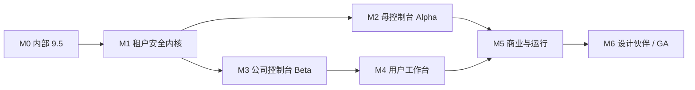

# 06｜路线图、里程碑与验收门槛

## 1. 执行策略

主线分成两段：

1. **内部 9.5**：先证明当前单公司系统在真实代码、数据、浏览器、Worker、模型、成本、发布和恢复上可控。
2. **平台化**：在不破坏内部业务的前提下建立租户内核，再逐层开放母控制台、公司控制台和用户控制台。

第二家公司不是用来帮助发现基础隔离问题的测试工具。只有 M1 租户安全门槛全部通过，才允许进入真实客户数据。

## 2. “内部 9.5”的客观定义

9.5 不是主观代码观感，而是 100 分证据表达到至少 95 分，且无任何否决项。

| 维度 | 权重 | 证据 |
|---|---:|---|
| 功能与业务闭环 | 20 | 真实用户旅程、写入/审批/结果/反馈闭环 |
| 数据真实与可追溯 | 15 | 来源、时间、组织、项目、任务、输出链路 |
| 可靠性与并发正确性 | 15 | 队列、幂等、预算预留、重试、故障注入 |
| 安全与权限 | 15 | 认证、作用域、敏感操作、会话撤销、依赖扫描 |
| AI 生产治理 | 10 | 精确模型、就绪、预算、工具、引用、记忆确认 |
| 发布、监控与恢复 | 10 | `verify.sh`、制品、Worker 身份、回滚、备份恢复 |
| UX 与可解释性 | 10 | 浏览器关键流程、空/错/降级、阶段进度、无障碍 |
| 可维护性 | 5 | 测试、迁移、模块边界、文档、无高危复杂文件 |

### 2.1 否决项

有任一项时即使算术分数达到 95，也不能称为 9.5：

- 未关闭的 P0/P1 安全或数据正确性问题。
- 生产就绪门禁失败、Worker/版本身份不一致。
- 付费模型调用绕过原子预算预留。
- 关键业务仍以模拟/缓存/未知来源结果冒充实时真实数据。
- 关键写操作无鉴权、无幂等或无审计。
- 备份未验证可恢复，或发布没有安全回滚路径。
- 浏览器核心旅程无法在真实数据上完成。

### 2.2 9.5 证据包

每次评分必须保存：Git SHA、工作树说明、数据库迁移、测试报告、`scripts/verify.sh` 结果、浏览器截图/录屏、健康接口、Worker/队列状态、模型与预算证据、数据来源审计、备份恢复报告、未关闭问题。评分只对该快照有效。

## 3. 总体阶段

| 阶段 | 有效开发周 | 目标窗口 | 结果 |
|---|---:|---|---|
| M0 内部 9.5 | 4 | 2026-07-15 ～ 08-14 | 内部生产基线冻结 |
| M1 租户安全内核 | 5 | 2026-08-17 ～ 09-18 | 第二租户可安全存在但不对外 |
| M2 母控制台 Alpha | 5 | 2026-09-21 ～ 10-23 | 平台可控开通内部测试公司 |
| M3 公司控制台 Beta | 5 | 2026-10-26 ～ 11-27 | 公司管理员可自助治理 |
| M4 用户工作台 | 4 | 2026-11-30 ～ 12-25 | 用户任务、AI、记忆与透明度闭环 |
| 缓冲 | — | 2026-12-28 ～ 2027-01-01 | 节假日/缺陷缓冲，不承诺功能 |
| M5 商业运行闭环 | 4 | 2027-01-04 ～ 01-29 | 计量、账单、发布、监控、灾备 |
| M6 设计伙伴到 GA | 3 | 2027-02-01 ～ 02-19 | 3–5 家封闭测试并达 GA 门槛 |

这是 30 个有效开发周的基准计划。若 M0 未通过，后续日期顺延，不通过降低验收标准维持日期。

## 4. M0｜内部 9.5（4 周）

### 4.1 目标

把当前 V-KPI 单公司系统固定为可重复验证的生产基线，不在此阶段开放多租户写路径。

### 4.2 工作包

| 工作流 | 内容 |
|---|---|
| 发布基线 | 固定 Git/制品/迁移/Worker 身份；统一 `verify.sh`；原子 current/previous/rollback |
| 运行正确性 | 清理队列歧义、僵尸任务、idle transaction；验证 Scheduler/Worker 信任 |
| 模型与预算 | 精确模型绑定、Readiness、Provider 探测、预算 Reservation、旧入口封锁 |
| 数据可信 | 来源、时间、真实/缓存/未知状态；关键 KOL/项目/Dealer/Event 路径验证 |
| AI 助手 | 会话、SSE、候选确认、记忆事件、行动草稿、DSAR 基础 |
| 权限 | 现有单公司路径全量鉴权；员工暂停与旧会话风险修复 |
| 恢复 | 数据库与对象备份清单、实际恢复演练、回滚验收 |
| 浏览器 | 管理员、经理、员工、Viewer 四角色真实关键旅程 |

### 4.3 退出门槛

- 9.5 证据表 ≥95/100，所有维度达到最低线，无否决项。
- `scripts/verify.sh` 严格模式通过；前后端/Worker/迁移身份一致。
- 所有付费 LLM 生产入口都通过原子预留；未发现旁路。
- 核心浏览器旅程真实通过，阶段任务能展示增量结果。
- 备份已实际恢复，恢复后关键表和业务流程核对通过。
- 形成不可变内部 Release 基线和已知限制清单。

## 5. M1｜租户安全内核（5 周）

### 5.1 目标

建立真实工作区、统一请求上下文和强制租户边界，让两个测试公司可以在同一环境存在而不串数据。

### 5.2 工作包

1. ADR：租户、区域、环境、身份、权益、策略和审计契约。
2. 统一 `TenantContext`，登录后显式工作区选择和 Token 切换。
3. 清除认证业务路径默认组织 1 回退；遗留脚本显式限定组织 1。
4. 项目、任务、KOL、成员组、通知、偏好、审计、智能体、成本等补组织字段。
5. 复合唯一/FK、Repository 强制范围、PostgreSQL RLS。
6. 缓存、对象、搜索、向量、队列和导出补组织命名空间。
7. 平台账号/角色与公司角色分离；移除硬编码邮箱 Owner 绕过。
8. 权益/策略 Evaluator 骨架，返回决策解释。
9. 事务 Outbox 与统一审计信封。
10. 自动化双租户攻击矩阵。

### 5.3 退出门槛

- 所有租户表 `organization_id NOT NULL`，无未归属行。
- 所有跨租户 HTTP、缓存、队列、SSE、导出和对象测试 100% 拒绝。
- 租户解析缺失/歧义全部失败关闭，无自动进入公司 1。
- 成员/公司暂停后 60 秒内所有会话和异步入口失效。
- 平台角色与公司角色完全分离，无永久万能 Owner。
- 建立第二个合成测试公司，自动验证 20+ 核心资源类型。

## 6. M2｜母控制台 Alpha（5 周）

### 6.1 目标

平台人员可以安全地开通、暂停和治理内部测试租户，并控制套餐、模块、区域、模型和全局风险。

### 6.2 工作包

- 公司生命周期状态机与幂等开通 Operation。
- 模块 Manifest、能力目录、套餐版本、订阅和权益快照。
- Region/Deployment 基础表与标准共享 Cell 绑定。
- Provider Account、Model Catalog、租户模型策略版本。
- 配额模板、公司分配、预算阈值。
- Entitlement、Feature Flag、Kill Switch 三类控制分开。
- 平台总览、公司、套餐、区域、模型、Flag、运行、审计页面。
- 普通只读支持访问；Break-glass 申请/审批/TTL 骨架。

### 6.3 退出门槛

- 母控制台可从草稿到激活开通合成公司，失败可恢复、重复请求不重复创建。
- 暂停/恢复在 API、Worker、模型、Webhook、会话上行为一致。
- 模块未授权时前后端和异步入口都拒绝。
- 公司绑定明确区域/版本/模型策略和配额。
- L3/L4 变更有 MFA/审批和强审计回执。
- 仅允许内部测试公司，不接真实外部客户。

## 7. M3｜公司控制台 Beta（5 周）

### 7.1 目标

公司 Owner/管理员不依赖平台员工即可管理组织、数据和企业 AI 资产。

### 7.2 工作包

- 正式部门树与临时团队分离。
- 成员邀请、角色委派、暂停、会话撤销、离职交接。
- 系统角色模板、自定义角色版本和资源授权。
- 项目可见性、数据分类、导出和模型策略。
- 企业知识空间、来源、文档 ACL、同步与索引。
- 企业智能体定义、版本、工具/模型/记忆策略、评测和发布。
- 工作流定义、版本、触发器、审批、运行和死信。
- 公司用量、子预算、安全和内部审计。

### 7.3 退出门槛

- 公司管理员可完整完成部门 → 成员 → 角色 → 项目 → 知识 → 智能体 → 工作流配置。
- 部门/项目管理员不能跨范围管理或查看。
- 知识检索先租户/ACL 后相似度，交叉测试无泄露。
- 智能体/工作流发布绑定不可变版本、模型、工具、预算和审批。
- 离职交接无孤儿项目、知识源、智能体、工作流或个人任务。
- 公司审计只看本公司，平台内部字段正确隐藏。

## 8. M4｜用户工作台（4 周）

### 8.1 目标

把现有任务、项目、顾问和记忆能力统一成个人工作入口，并让 AI 与个人数据可见、可控、可解释。

### 8.2 工作包

- `/me/home`、任务、项目、数据和审批。
- AI 助手会话、SSE 恢复、来源、工具过程和行动草稿。
- 候选记忆、确认事实、暂停、逐条删除、全部删除和导出。
- 站内通知事件、投递、已读、摘要、免打扰和渠道验证。
- 个人角色/项目授权、会话/设备与撤销。
- 个人用量、配额和费用展示策略。
- 工作区切换、移动/窄屏和 WCAG 2.2 AA。

### 8.3 退出门槛

- 用户只能看到本人和被授权资源；多公司切换后无旧公司缓存。
- 个人记忆默认需确认，公司管理员不能读正文。
- 个人数据导出/删除有 Operation 和审计证明。
- 通知有实际投递状态，不把“保存偏好”当成功发送。
- 个人用量归属率 ≥98%，未知值不伪装为精确 0。

## 9. M5｜商业与运行闭环（4 周）

### 9.1 目标

让套餐、用量、供应商成本、客户账单、版本发布和区域运行形成一个可运营闭环。

### 9.2 工作包

- 统一 Quota/Usage Reservation，供应商成本与客户计量分账。
- 用量聚合、对账、账单草稿、Credits/调整、欠费宽限状态。
- Release Artifact、签名、SBOM、审批、区域灰度和自动暂停。
- OpenTelemetry/Prometheus、日志、Trace、正式 SLO 和告警。
- 不可变审计归档、SIEM、保留和法律冻结。
- 完整 Break-glass、实时通知、自动撤销和复盘。
- 备份恢复、Cell 故障、供应商故障和区域 DR 演练。

### 9.3 退出门槛

- 100% 付费行为有预留、结算/释放、用量和成本事件。
- ≥98% Provider 成本可归属公司；账单差异有对账队列。
- 发布可内部 →5%→25%→100%，SLO 异常自动暂停。
- 应用版本回滚 <10 分钟；破坏性迁移走兼容阶段。
- L3/L4 审计写失败时操作失败关闭。
- DR 演练达到套餐承诺 RTO/RPO。

## 10. M6｜设计伙伴与 GA（3 周）

### 10.1 目标

邀请 3–5 家不同规模的设计伙伴，验证开通、治理、日常使用、成本和支持，不同时追求大规模销售。

### 10.2 测试组合

- 标准共享租户 2 家。
- 高用量/复杂部门租户 1 家。
- BYOK 或专属部署租户 1 家（可选）。
- 不同角色与数据等级；至少一个多公司用户。

### 10.3 GA 门槛

| 范畴 | 门槛 |
|---|---|
| 安全 | 外部渗透/跨租户测试无开放高危问题 |
| 可靠性 | 30 天关键 SLO 达标，无 SEV0/未解决 SEV1 |
| 开通 | 标准租户 30 分钟内完成，失败可恢复 |
| 自助 | ≥80% 常规管理动作无需平台介入 |
| 计量 | 公司/功能/供应商归属 ≥98%，账单可解释 |
| AI | 精确模型、来源、工具、成本、行动均可追溯 |
| 隐私 | 导出/删除/记忆控制/保留流程全部演练 |
| 运行 | 发布、回滚、备份恢复、Provider 故障演练通过 |
| 文档 | 管理员、用户、支持、事故和私有化边界文档齐全 |

## 11. 团队配置

### 11.1 基准 10 人

| 职能 | 人数 | 重点 |
|---|---:|---|
| 产品负责人/业务架构 | 1 | 套餐、角色、流程、设计伙伴 |
| 技术负责人/架构 | 1 | 租户内核、决策、技术门槛 |
| 后端/数据 | 3 | IAM/权益、业务资产、计量/审计 |
| 前端 | 2 | 三控制台、设计系统、可访问性 |
| 平台/SRE | 1 | 区域、发布、可观测、恢复 |
| QA/安全 | 1 | 自动化、跨租户、性能、渗透 |
| 产品设计/研究 | 1 | 信息架构、管理流程、用户验证 |

AI 工具可提高扫描、测试、迁移、文档和普通页面产能，但 Owner、权限、计费、迁移、审计和事故设计必须由人类负责并复核。

### 11.2 较小团队

5–6 人可合并产品/设计、架构/后端、QA/SRE，但路线图按 38–44 周，且 M1、M5、M6 的安全与恢复窗口不压缩。

## 12. 双周 Sprint 节奏

- 第 1 天：上个 Sprint 证据复核、目标与风险冻结。
- 每日：代码、迁移、API、页面和自动化证据随任务更新。
- 第 8 天：功能冻结，开始完整回归、跨租户和浏览器验证。
- 第 9 天：安全/数据/运行审查，修复或退回。
- 第 10 天：Demo 只展示真实环境；形成可发布或明确未通过结论。

每个 Epic 都必须在同一 Sprint 中交付代码、测试、遥测、审计、文档和回滚，不把“以后补监控/权限”作为默认收尾。

## 13. 依赖与关键路径

关键路径：

`内部 9.5 → TenantContext → 租户数据迁移/RLS → Policy+Entitlement → 公司生命周期 → 公司治理 → 用量账单 → 设计伙伴`。

可并行：

- M1 后半开始搭母控制台设计系统和页面壳。
- M2 同时开发部门/成员与个人工作台信息架构。
- 计量事件 Schema 在 M1 冻结，M2–M4 逐模块接入，M5 聚合账单。
- Release/Audit 实体在 M2 建骨架，M5 完成灰度和不可变归档。

禁止并行：

- 租户表尚未强隔离前接真实第二家公司。
- 用量归属尚未完成前发布按量收费。
- Break-glass 尚未完成前用平台 Owner 进入客户正文。

## 14. 风险登记

| 风险 | 早期信号 | 处理 |
|---|---|---|
| 默认 org1 残留 | 请求/任务无组织仍成功 | 静态扫描 + 运行拒绝 + 删除豁免 |
| 迁移范围失控 | 大量表一次性改写、无影子比较 | 分波次双写/回填/读切换/约束 |
| 权限爆炸 | 页面大量角色判断、客户难理解 | 动作目录 + 角色模板 + 关系范围 + 模拟器 |
| 计量不可信 | 未归属成本高、重复扣量 | 原子预留 + 外部请求 ID + 每日对账 |
| 控制概念混淆 | Flag 同时承担套餐/权限 | 三类表、三类角色、统一解析 |
| AI 成本失控 | Token/任务突增、Fallback 变贵 | 任务绑定、预算、熔断、灰度 |
| 发布回滚是假象 | 破坏性迁移后只能回代码 | Expand/Migrate/Contract |
| 永久超管 | 支持依赖 Owner 邮箱 | 正常支持授权 + Break-glass + 复核 |
| 页面领先后端 | UI 有按钮但服务端无边界 | API/策略/审计先于或同时交付 |
| 设计伙伴过早 | P0 被客户数据暴露 | M1/M5 硬门槛，合成租户先验证 |

## 15. 范围切割

### 15.1 GA 必须

租户隔离、公司生命周期、套餐/模块权益、平台/公司/个人角色、项目数据范围、模型路由、统一配额、强审计、支持/紧急授权、发布灰度、备份恢复、任务/AI/记忆基本用户工作台。

### 15.2 可延后

- 多主区域主动-主动。
- 每租户独立云账号自动化。
- 高级 Marketplace 和第三方模块分成。
- 复杂税务/多实体财务，自研支付清算。
- 任意自定义智能体代码执行。
- 全功能原生移动 App；首发响应式 Web/PWA。
- 大规模自助私有化安装器。

## 16. 每阶段 Go/No-Go 会议

Go 需要产品、技术、QA/安全、SRE、数据/财务（涉及计量时）共同签字。会议只接受可复现证据，不接受“基本完成”。

No-Go 后：记录阻断项、Owner、复验日期和影响；后续阶段可以做不依赖的设计/开发，但不能宣称上阶段通过，也不能开放被阻断的真实流量。
