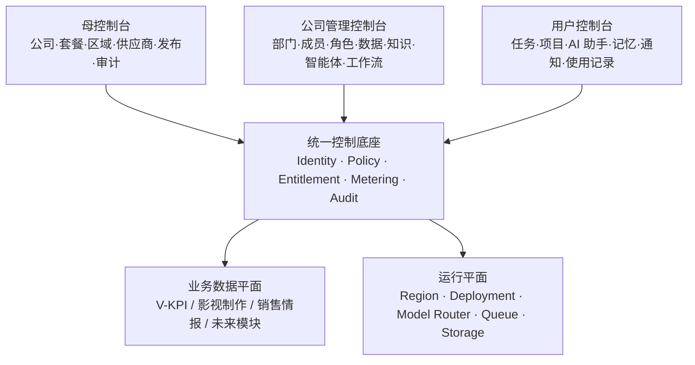

# 通用 AI 企业平台 APP：三层控制台总路线图

版本：1.0

基线日期：2026-07-15

适用范围：V-KPI 现有系统向“可开通多家公司、可授权多个业务模块、可分区部署、可计量收费”的通用企业 AI 平台演进。

## 1. 结论先行

这套 APP 不应被设计成三个彼此割裂的后台，而应是一套共享身份、策略、授权、计量和审计底座的三层控制平面：

1. **母控制台（Platform Control Plane）**：平台方管理公司生命周期、商业授权、运行资源、发布与全局风险。
2. **公司管理控制台（Tenant Control Plane）**：每家公司在自己的边界内管理组织、人员、数据、知识、智能体和工作流。
3. **用户控制台（Personal Workspace）**：个人完成任务、项目协作、AI 对话、记忆管理和使用透明度查看。

现有 V-KPI 代码已经具备组织/成员种子、项目数据范围、四级权限、模型供应商探测与切换、预算保护、审计日志、个人偏好、通知和按“公司 + 用户”隔离的顾问记忆，因此不是从零开发。当前主要缺口是：平台级商业授权、真实多租户上下文、统一策略决策、客户计量账本、分区部署、发布编排、不可抵赖审计和紧急授权。

推荐执行顺序严格遵守：**先把当前内部系统做到可证明的 9.5，再冻结租户内核并逐步拆成多租户平台**。不能在内部正确性、数据来源、预算、队列、发布和恢复仍不稳定时直接复制出多家公司。

## 2. 目标架构

### 2.1 不能违反的边界

- 母控制台默认只能查看租户运行元数据，不能静默读取客户业务内容。
- 公司管理员不能查看平台主密钥、其他公司、平台内部成本底价或平台员工信息。
- 用户不能给自己提权，不能读取他人私人记忆，也不能绕过公司数据策略。
- **套餐授权不等于人员权限**：模块有授权、Feature Flag 允许、用户有权限、资源关系允许、配额与风险控制均通过，操作才放行。
- 显式拒绝高于允许；上层设置可限制下层，但下层不能自行扩大上层授权。
- 所有高风险变更必须产生可查询的操作回执；关键审计写入失败时，操作必须失败关闭。
- 不保留永久“万能管理员”。平台支持访问采用限时、限权、带原因和审批的紧急授权会话。

## 3. 产品与代码的切割原则

平台核心必须与具体行业模块解耦。V-KPI、影视项目、渠道分析等都作为可授权模块接入，不把行业字段写入租户、计费、权限或发布核心。

每个业务模块至少声明以下契约：

| 契约 | 必须声明的内容 |
|---|---|
| 模块清单 | 模块 ID、版本、名称、依赖、支持区域、数据等级 |
| 能力清单 | 页面、API、后台任务、智能体工具、导入导出能力 |
| 权限清单 | 动作、资源类型、可授权范围、默认角色映射 |
| 数据清单 | 租户表、保留周期、删除/导出方式、区域约束 |
| 计量清单 | 席位、任务、查询、Token、抓取、存储等计量事件 |
| 运行清单 | 队列、模型、供应商、密钥类型、健康检查、降级方案 |
| 审计清单 | 高风险动作、敏感读取、自动化决策和人工确认事件 |
| 版本清单 | 数据迁移、兼容范围、Feature Flag、回滚条件 |

这样完成底层切割后，平台可以承载多个行业项目；但“可以承载”仍取决于模块是否实现了自己的数据契约、工作流和验收测试，不能只靠代码目录拆分来宣称通用。

## 4. 分阶段总览

| 阶段 | 周期 | 核心结果 | 硬门槛 |
|---|---:|---|---|
| M0 内部 9.5 | 4 周 | 当前 V-KPI 单租户达到可证明的生产质量 | 综合验收 ≥95/100、无 P0/P1 开放项 |
| M1 租户安全内核 | 5 周 | 真实组织上下文、全表租户边界、策略决策点 | 跨租户攻击矩阵 100% 拒绝 |
| M2 母控制台 Alpha | 5 周 | 公司、套餐、模块、区域、模型、配额、审计 | 可安全开通/停用首批内部租户 |
| M3 公司控制台 Beta | 5 周 | 部门、成员、角色、项目、知识、智能体、工作流 | 租户管理员可自助完成完整配置 |
| M4 用户工作台 | 4 周 | 任务、项目、AI 助手、记忆、通知、个人授权 | 个人数据可见、可控、可导出、可删除 |
| M5 商业与运行闭环 | 4 周 | 用量、账单、成本、发布、监控、灾备 | 用量与供应商账单对账率 ≥98% |
| M6 封闭测试到 GA | 3 周 | 3–5 个设计伙伴、容量/安全/恢复演练 | 全部 GA 门槛通过 |

基准计划为 **30 周、AI 辅助的 8–10 人核心团队**。5–6 人团队应按 38–44 周估算；不能通过压缩安全、迁移和验证周期换取表面进度。

## 5. 文档目录

| 文档 | 用途 |
|---|---|
| [01 产品架构与信息架构](./01-product-and-information-architecture.md) | 三层控制台职责、角色、导航、生命周期、模块契约 |
| [02 身份权限与租户边界](./02-iam-and-data-boundaries.md) | RBAC/ABAC/ReBAC、授权顺序、隔离、紧急访问 |
| [03 数据、API 与事件契约](./03-data-api-and-event-contracts.md) | 核心表、接口、事件、幂等、迁移与删除契约 |
| [04 页面与控制细则](./04-ui-control-specification.md) | 每个页面的字段、动作、风险等级、异常态和验收 |
| [05 运行、安全与成本治理](./05-runtime-security-and-operations.md) | 区域、模型、配额、成本、发布、监控、审计、灾备 |
| [06 路线图与验收门槛](./06-roadmap-milestones-and-acceptance.md) | 30 周阶段计划、依赖、团队、验收与延后项 |
| [07 Epic、排期与 RACI](./07-epic-backlog-and-raci.md) | 可直接进入项目管理工具的工作包和负责人模型 |
| [08 当前代码映射与改造顺序](./08-current-code-mapping.md) | 已有/可复用/需重构/缺失的代码证据与迁移波次 |

## 6. 统一术语

| 术语 | 定义 |
|---|---|
| 平台 | 运营这套 SaaS/私有化产品的主体 |
| 公司/租户 | 数据、权限、计费和运行边界独立的客户组织 |
| 工作区 | 用户当前选择并进入的公司上下文；必须显式、可验证 |
| 模块 | 可单独授权和计量的业务能力包 |
| 套餐 | 模块、席位、配额、支持等级和商业条款的组合 |
| 权限 | 某主体对某资源执行某动作的许可 |
| 数据范围 | 权限允许后，主体实际可见的资源集合 |
| Feature Flag | 控制能力是否在特定范围生效，不承担商业授权或人员授权职责 |
| 紧急授权 | 限时、限权、可审计的支持/救援访问，而非永久超管 |
| 控制平面 | 管理授权、配置、发布和运行状态的系统 |
| 数据平面 | 承载客户业务数据、AI 任务和实际工作流的系统 |

## 7. 本版明确不做的事

- M0 不启动大规模多租户数据搬迁，只冻结目标契约并完成内部 9.5。
- 首版不自研支付清算；采用账单账本 + 第三方支付接口边界。
- 首版不同时支持每租户独立云账号；先支持共享集群强隔离与指定租户独立部署。
- 首版不让公司管理员自行上传任意模型执行代码，只允许使用平台审核过的模型目录。
- 首版不提供任意 SQL/任意跨域智能体工具；工具必须在模块清单中声明并受策略控制。
- 不把 Feature Flag、角色权限、套餐授权或预算控制合并为一个万能配置表。
