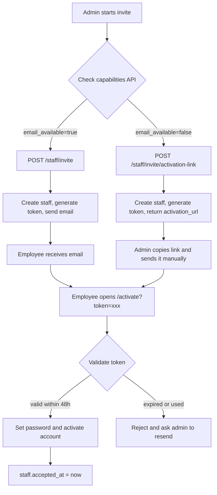

# Staff Invite Flow

## 1. Overview

The staff invite capability has two supported paths:

- Email magic link: use `POST /api/admin/staff/invite` when SMTP is configured and `email_available=true`.
- One-time activation link: use `POST /api/admin/staff/invite/activation-link` when SMTP is unavailable, or when the admin wants to send the link manually through Lark, WeChat, Slack, or another internal channel.

The frontend should call `GET /api/admin/staff/invite/capabilities` first, then choose the visible invite method from `delivery_methods`. The design goal is simple: staff invitation must still work when SMTP is not configured.

## 2. Invite Flow



## 3. verification_status

`GET /api/admin/staff` returns `verification_status` for each staff member so the UI can render a badge without extra API calls.

| status | Color | Meaning | Trigger condition |
|---|---|---|---|
| verified | Green | Email is fully verified | `users.email_verified = true` |
| activated | Green | Invite was accepted, but email was not separately verified | `staff.accepted_at` is not null |
| pending | Yellow | Invite is waiting for acceptance | `staff.invited_at` exists and an active `staff_invite` token exists |
| expired | Gray | Invite exists but token is expired or used | `staff.invited_at` exists and no active token exists |
| draft | Gray | Staff row exists but invite has not been sent | Fallback state |

## 4. delivery_method

`GET /api/admin/staff` also returns `delivery_method`. Because there is no dedicated schema column for historical delivery method, this value is computed from existing fields.

| method | Meaning |
|---|---|
| email | Email magic link path, inferred when accepted staff also has verified email |
| manual_link | One-time activation link path, inferred fallback for accepted staff without verified email |
| pending_invite | Invite has been generated but not accepted yet |
| unknown | Historical or incomplete data where the delivery path cannot be inferred |

## 5. Environment Variables

| Variable | Default | Purpose |
|---|---|---|
| `SMTP_HOST` | empty | SMTP server host |
| `SMTP_USER` | empty | SMTP username |
| `SMTP_PASS` | empty | SMTP password |
| `FROM_EMAIL` | empty | Email sender address |
| `SITE_URL` | `http://localhost:5173` for activation-link fallback | Base URL used to build activation links |
| `RESEND_API_KEY` | empty | Optional Resend API key if a Resend sender is added later |
| `ALLOWED_EXTERNAL_STAFF_DOMAINS` | empty | Comma-separated allowlist for external staff email domains |
| `ALLOW_EXTERNAL_STAFF_EMAILS` | false | Full switch to allow any external staff email domain; use carefully |

## 6. API Reference

### GET /api/admin/staff/invite/capabilities

Returns current invite capabilities. The frontend uses this response to decide which invite controls to show.

```json
{
  "email_available": false,
  "external_emails_allowed": false,
  "allowed_domains": ["viltrox.com"],
  "token_ttl_hours": 48,
  "manual_activation_link_available": true,
  "delivery_methods": ["manual_link"],
  "site_url_configured": true
}
```

### POST /api/admin/staff/invite

Creates staff and sends an email magic link. If SMTP is not configured, this endpoint returns an error and points the caller to the activation-link endpoint.

Request:

```json
{
  "email": "zhang@viltrox.com",
  "full_name": "Zhang San",
  "role": "operations",
  "permissions_json": {}
}
```

SMTP available response:

```json
{
  "id": 110,
  "user_id": 1234,
  "role": "operations",
  "email": "zhang@viltrox.com",
  "invite_sent": true
}
```

SMTP unavailable response:

```text
400 Email delivery unavailable. Use /api/admin/staff/invite/activation-link to generate a manual activation link.
```

### POST /api/admin/staff/invite/activation-link

Creates staff and returns a one-time activation link. It does not send email.

Request body matches `/api/admin/staff/invite`.

Response:

```json
{
  "staff_id": 110,
  "user_id": 1234,
  "email": "zhang@viltrox.com",
  "full_name": "Zhang San",
  "role": "operations",
  "activation_url": "https://vkpi.viltrox.com/activate?token=xxx",
  "token_hint": "xxxx...yyyy",
  "expires_at": "2026-05-21T16:00:00Z",
  "expires_in_hours": 48,
  "delivery_method": "manual_link"
}
```

Security notes:

- The full token is returned only in the response body.
- Audit logs store `token_hint`, not the full token.
- Creating a new invite token marks any previous unused `staff_invite` token for the same user as used.

### GET /api/admin/staff

Returns all staff members. Each member now includes invite status fields.

```json
{
  "members": [
    {
      "id": 1,
      "email": "admin@viltrox.com",
      "full_name": "Admin",
      "role": "admin",
      "verification_status": "activated",
      "delivery_method": "manual_link",
      "invite_token_active": false
    }
  ]
}
```

## 7. Troubleshooting

| Symptom | Likely cause | Fix |
|---|---|---|
| Invite fails with `Email delivery unavailable` | SMTP environment variables are missing | Configure `SMTP_HOST`, `SMTP_USER`, `SMTP_PASS`, and `FROM_EMAIL`, or use `/staff/invite/activation-link` |
| Gmail or another external email is rejected | Default policy only allows `viltrox.com` | Set `ALLOWED_EXTERNAL_STAFF_DOMAINS=gmail.com,qq.com` or `ALLOW_EXTERNAL_STAFF_EMAILS=1` |
| Employee sees an expired activation link | `staff_invite` token is older than 48 hours or already used | Generate a new activation link or resend invite |
| Activation URL contains localhost | `SITE_URL` is using a development value | Set `SITE_URL=https://vkpi.viltrox.com` in production |
| `verification_status` is `draft` | Staff exists but has not gone through an invite path | Call `/staff/invite` or `/staff/invite/activation-link` |
| `delivery_methods` only contains `manual_link` | SMTP is not configured | Configure SMTP or keep using manual activation links |

## 8. Optional SMTP Setup

### Option A: Resend

Resend is a reasonable production option once domain DNS access is available.

1. Create a Resend account and API key.
2. Add DNS records for `viltrox.com` as required by Resend.
3. Configure environment variables:

```bash
export RESEND_API_KEY=re_xxxxxxxx
export FROM_EMAIL=noreply@viltrox.com
export SITE_URL=https://vkpi.viltrox.com
```

4. Add the Resend sender implementation or SMTP bridge if the backend is still using SMTP-only sending.
5. Restart the backend.
6. Verify `GET /api/admin/staff/invite/capabilities` returns `email_available=true` once the sender is wired.

### Option B: SMTP

Configure a standard SMTP provider:

```bash
export SMTP_HOST=smtp.example.com
export SMTP_USER=noreply@viltrox.com
export SMTP_PASS=example-password
export FROM_EMAIL=noreply@viltrox.com
export SITE_URL=https://vkpi.viltrox.com
```

For Gmail, use an App Password. Do not use a normal account password.

