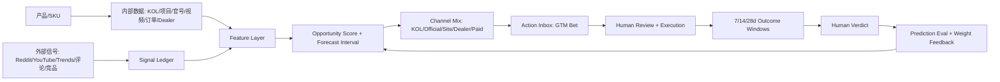

# V-KPI 真实数据、算法、代码与来源全景

日期: 2026-07-07  
本地代码基线: `09f2c3c27` / branch `codex/dashboard-real`  
本地库验证时间: 2026-07-07 13:22 America/New_York  
目标: 把 V-KPI 从 KOL 工具升级为「产品上市增长大脑」时, 哪些真实数据已有、哪些代码已存在、哪些来源/算法可借鉴、哪些闭环缺口必须补齐, 一次讲完整。

---

## 0. 一页结论

V-KPI 有机会, 但机会不在「找 KOL」这个单点。真正的机会在:

> 以 SKU 为中心, 把市场信号、KOL、项目履约、官号、自媒体、Dealer、独立站、付费放大、结果回流合成一条可审计的产品增长闭环。

当前系统的真实优势:

1. 已有内部私有数据: KOL 池、视频证据、项目/履约、Action Inbox、推荐结果、官号内容指标。
2. 已有 GTM Preview/Channel Brain 雏形: 能从 SKU 生成路线、KOL 候选、官号建议、预算组合、承接检查、Action Inbox 预览。
3. 已有闭环账本骨架: `vkpi_gtm_outcomes`、verdict、window refresh、weight feedback 都已有代码或迁移。
4. 已有「诚实态」设计: Dealer 0、Shopify 0、外部数据缺失时返回 `data_missing`, 没有编造。

当前最大缺口:

1. `vkpi_gtm_outcomes = 0`: 还没有真正执行后的 GTM 结果样本, 所以「预判能力」还不能被证明。
2. Dealer 数据为 0: 线下/零售/经销商通路还没有数据底座。
3. Shopify/GoAffPro 本地为 0: 独立站成交/短链/佣金归因本地闭环未接上。
4. `gtm_bet` 还没有完整人工执行/完成流: preview 能出建议, materialize 能落 Action Inbox, 但前端还没有真正把行动闭环跑起来。
5. 外部市场信号还不是系统级账本: Reddit、YouTube comments、Google Trends、Amazon/BH 评论、竞品动态需要进入统一 `signal_ledger`, 否则无法评估来源质量。

客观判断:

如果继续停留在「KOL 推荐工具」, 竞争力有限, CreatorIQ/Traackr/Upfluence/Modash 都已经很强。  
如果做成「物理产品 SKU 上市增长大脑」, 竞争力会明显不同, 因为多数平台只覆盖创作者、归因、社媒监听、BI 的某一块, 很少把 **产品上市 → 市场判断 → 渠道打法 → 人审执行 → 结果账本 → 学习回流** 做成一个品牌自己的私有操作系统。

---

## 1. 当前本地真实数据盘点

### 1.1 表计数

查询方式: `PYTHONPATH=backend .venv/bin/python` + `app.db.connection.get_conn()`。  
当前库是本地/当前运行配置口径, 不是线上生产完整快照。

| 数据表 | 当前行数 | 结论 |
|---|---:|---|
| `vkpi_products` | 369 | SKU/产品底座已存在 |
| `vkpi_product_persona` | 353 | 产品-人群画像已存在 |
| `vkpi_launch_briefs` | 表不存在 | 上市 brief 独立表未落地或命名不同 |
| `vkpi_kol_pool` | 1225 | KOL 池有基础规模 |
| `vkpi_kol_video_evidence` | 2717 | 视频证据已有规模 |
| `vkpi_analysis_cache` | 728 | 视频/内容分析缓存已存在 |
| `llm_deep_results` | 表不存在 | 深析结果可能在其他表/缓存, 需统一命名 |
| `vkpi_projects` | 54 | 项目履约底座存在 |
| `vkpi_project_kol_assignments` | 2189 | 项目-KOL 关系数据很强 |
| `vkpi_action_inbox` | 271 | 人审/行动队列已存在 |
| `vkpi_recommendation_outcomes` | 778 | 推荐结果/反馈类数据已有 |
| `vkpi_agent_outcome_evaluations` | 56 | Agent 结果评估已有少量样本 |
| `vkpi_gtm_outcomes` | 0 | GTM 闭环还未开始沉淀 |
| `vkpi_dealers` | 0 | Dealer 通路是硬缺口 |
| `vkpi_channel_post_metrics` | 19865 | 官号/渠道内容指标很强 |
| `vkpi_shopify_orders` | 0 | 本地独立站成交未闭环 |
| `vkpi_goaffpro_kol_links` | 0 | KOL 短链/佣金本地未闭环 |

### 1.2 Action Inbox 当前分类

| category | 行数 | 可用于 Market Brain 的含义 |
|---|---:|---|
| `failed_retry` | 153 | 可做「失败视频/失败任务重试」 |
| `kol_profile` | 35 | 可做「补 KOL 资料」 |
| `deep_missing` | 31 | 可做「补视频深析」 |
| `inventory_low` | 26 | 可做「库存/项目风险」 |
| `content_candidate` | 21 | 可做「内容候选」 |
| `discovery_enroll` | 5 | 可做「新 KOL 入池」 |
| `gtm_bet` | 0 | GTM 押注建议尚未 materialize |
| `gtm_verdict` | 0 | GTM 裁决任务尚未生成 |

### 1.3 用真实 SKU 做 GTM Preview

样本 SKU: `VL-LEN072`  
国家: `US`  
预算: `$3000`  
目标: `conversion`

`gtm_plan_preview.build_preview(...)` 返回:

| 段落 | 状态 | 说明 |
|---|---|---|
| `thesis` | ready | 有主判断 |
| `forecast` | ready | 3 条条件化预判 |
| `market_opportunity` | empty | 外部市场机会还缺真实来源 |
| `kol_candidates` | ready | 8 个 KOL 候选 |
| `dealer_targets` | data_missing | `vkpi_dealers` 0 行 |
| `official_channel_actions` | ready | 官号动作可出 |
| `shopify_indie_site_actions` | template | 独立站承接 checklist 可出, 但成交/短链数据缺 |
| `content_angles` | ready | 内容角度可出 |
| `budget_mix` | ready | 预算组合可出 |
| `action_inbox_items` | preview | 20 条待落库建议 |
| `success_metrics` | ready | 成功指标可出 |
| `conversion_readiness` | ready | 5 项转化准备度 |

覆盖率:

```json
{
  "sections_total": 12,
  "sections_ready": 11,
  "sections": {
    "thesis": "ready",
    "forecast": "ready",
    "market_opportunity": "empty",
    "kol_candidates": "ready",
    "dealer_targets": "data_missing",
    "official_channel_actions": "ready",
    "shopify_indie_site_actions": "template",
    "content_angles": "ready",
    "budget_mix": "ready",
    "action_inbox_items": "preview",
    "success_metrics": "ready",
    "conversion_readiness": "ready"
  }
}
```

`materialize.materialize_plan(..., dry_run=True)` 返回:

```json
{
  "dry_run": true,
  "gtm_plan_id": "gtmp_95c2b4c3d390",
  "bets_total": 20,
  "would_insert": 20,
  "already_present": 0,
  "requires_approval_all": true
}
```

这说明: 系统已经能生成 20 条 GTM 行动建议, 但还停在 dry-run / preview 阶段, 没有进入真实执行闭环。

### 1.4 Channel Brain 当前输出

样本 SKU: `VL-LEN072`, 预算 `$3000`, 目标 `conversion`。

`channel_mix.channel_mix(...)`:

| channel | status | allocated_usd | confidence | 说明 |
|---|---:|---:|---|---|
| `kol` | ready | 1012.5 | low | KOL 作为品牌层主力, 但报价/成本多为估算 |
| `official` | ready | 337.5 | medium | 官号 18 个, 6 平台, 粉丝合计约 1,205,115 |
| `site` | ready | 942.86 | data_missing | 独立站承接有预算, 但本地 Shopify 0 订单 |
| `dealer` | data_missing | 0 | data_missing | `vkpi_dealers` 0 行, 不派真金、不编数 |
| `paid` | ready | 707.14 | low | 付费放大只作为已验证内容后的放大杠杆 |

`dealer_scoring.dealer_targets(sku='VL-LEN072')`:

```json
{
  "status": "data_missing",
  "note": "vkpi_dealers 表存在但 0 行(硬件品牌盲区)",
  "items": []
}
```

`indie_site_actions.indie_site_actions('VL-LEN072')`:

```json
{
  "status": "ok",
  "summary": {"ready": 0, "missing": 4, "unknown": 0, "total": 4},
  "checklist": [
    {"key": "short_link", "state": "missing", "basis": "goaffpro=not_configured; public_base_url_set=false"},
    {"key": "landing_page", "state": "missing", "basis": "vkpi_products.product_url empty"},
    {"key": "commission_code", "state": "missing", "basis": "goaffpro=not_configured"},
    {"key": "purchase_path", "state": "missing", "basis": "shopify=not_configured"}
  ]
}
```

`official_planner.official_content_plan(sku='VL-LEN072')`:

```json
{
  "status": "ok",
  "official_count": 18,
  "posts_analyzed": 1604,
  "channels": 18
}
```

---

## 2. 当前代码入口和真实能力

### 2.1 前端页面/组件

| 文件 | 当前作用 |
|---|---|
| `frontend/src/components/vkpi/cockpit/pages/GtmCommandPage.tsx` | GTM/Market Brain 主页面。无 SKU 时显示 Market Brain 五卡; 选 SKU 后请求 GTM preview。 |
| `frontend/src/services/vkpi/gtmCommand-api.ts` | 规范化 `/market-brain/summary` 与 `/market-brain/gtm-plan/preview` 返回结构; 过滤私有字段。 |
| `frontend/src/components/vkpi/cockpit/components/ChannelMixPanel.tsx` | 渠道组合器展示; 已有品牌层/激活层、预算占比、data_missing UI。 |
| `frontend/src/components/vkpi/cockpit/components/DealerFitPanel.tsx` | Dealer fit 纯读展示。当前因 Dealer 0 行只能诚实缺席。 |
| `frontend/src/components/vkpi/cockpit/components/IndieSitePanel.tsx` | 独立站承接 4 项 checklist。 |
| `frontend/src/components/vkpi/cockpit/components/OfficialPlannerPanel.tsx` | 官方账号内容计划。 |
| `frontend/src/components/vkpi/cockpit/components/VerdictPanel.tsx` | GTM 裁决面板, 支持 context 查询与人工 decide。 |
| `frontend/src/components/vkpi/cockpit/components/ActionInboxPanel.tsx` | Action Inbox 展示; 已接入 VerdictPanel。 |

### 2.2 后端 API

| Endpoint | 文件 | 状态 |
|---|---|---|
| `GET /api/admin/vkpi/market-brain/summary` | `backend/app/api/routers/vkpi_market_brain_summary.py` | 全局五卡 summary |
| `GET /api/admin/vkpi/market-brain/playbook` | `backend/app/api/routers/vkpi_market_brain_summary.py` | playbook |
| `GET /api/admin/vkpi/market-brain/gtm-plan/preview` | `backend/app/api/routers/vkpi_market_brain.py` | SKU GTM 预览 |
| `POST /api/admin/vkpi/market-brain/gtm-plan/materialize` | `backend/app/api/routers/vkpi_gtm_materialize.py` | 可 dry-run/真落库, 但前端未成为主流程 |
| `GET /api/admin/vkpi/channel/mix` | `backend/app/api/routers/vkpi_channel_mix.py` | 渠道预算组合 |
| `GET /api/admin/vkpi/channel/dealer-fit` | `backend/app/api/routers/vkpi_dealer_scoring.py` | Dealer fit, 当前 0 数据 |
| `GET /api/admin/vkpi/channel/indie-site-actions` | `backend/app/api/routers/vkpi_indie_site.py` | 独立站承接 checklist |
| `GET /api/admin/vkpi/channel/official-plan` | `backend/app/api/routers/vkpi_official_planner.py` | 官方账号内容建议 |
| `GET /api/admin/vkpi/channel/official/{channel_id}/performance` | `backend/app/api/routers/vkpi_official_planner.py` | 官号表现 |
| `POST /api/admin/vkpi/gtm/windows/refresh` | `backend/app/api/routers/vkpi_gtm_windows.py` | GTM 7/14/28 天窗口回填 |
| `GET /api/admin/vkpi/gtm/verdicts/pending` | `backend/app/api/routers/vkpi_gtm_verdicts.py` | 待裁决 |
| `POST /api/admin/vkpi/gtm/verdicts/{verdict_id}/decide` | `backend/app/api/routers/vkpi_gtm_verdicts.py` | 人工裁决唯一入口 |
| `GET /api/admin/vkpi/gtm/verdicts/{verdict_id}/context` | `backend/app/api/routers/vkpi_gtm_weights.py` | 裁决上下文 + 权重回流预览 |

### 2.3 后端领域代码

| 文件 | 当前作用 |
|---|---|
| `backend/app/domains/market_brain/gtm_plan_preview.py` | 生成 SKU GTM 预览。 |
| `backend/app/domains/market_brain/gtm_bets.py` | 把 preview 变成可落 Action Inbox 的 bet items。 |
| `backend/app/domains/market_brain/materialize.py` | `dry_run=True` 零落库; `dry_run=False` 落 `gtm_bet`。 |
| `backend/app/domains/market_brain/verdict_flow.py` | 到期 bet 生成 `gtm_verdict`, 人工裁决写 `vkpi_gtm_outcomes`。 |
| `backend/app/domains/market_brain/gtm_windows.py` | 回填 `window_7d/14d/28d`。 |
| `backend/app/domains/market_brain/weekly_answers.py` | 从 `vkpi_gtm_outcomes` 读学习总结。 |
| `backend/app/domains/market_brain/weight_feedback.py` | 根据裁决结果预览/应用权重变化。 |
| `backend/app/domains/channel/channel_mix.py` | Binet-Field 60/40 风格渠道预算组合 v0。 |
| `backend/app/domains/channel/dealer_scoring.py` | Dealer fit v0。 |
| `backend/app/domains/channel/indie_site_actions.py` | Shopify/GoAffPro/landing page/purchase path 承接检查。 |
| `backend/app/domains/channel/official_planner.py` | 官方账号内容计划。 |

### 2.4 已有迁移

`migrations/217_vkpi_gtm_outcomes.sql` 已定义 GTM 结果账本:

关键列:

| 字段 | 含义 |
|---|---|
| `gtm_plan_id` | 一次 GTM 方案 ID |
| `product_sku` | SKU |
| `market` | 市场/国家/地区 |
| `segment` | 人群/细分 |
| `channel` | KOL/official/site/dealer/paid 等 |
| `action_type` | 行动类型 |
| `content_angle` | 内容角度 |
| `expected_result` | 预期结果 |
| `actual_result` | 实际结果 |
| `window_7d` / `window_14d` / `window_28d` | 执行后观察窗口 |
| `decision` | 人工裁决 |
| `lesson` | 学习沉淀 |
| `next_weight_change` | 下一轮权重变化 |
| `action_inbox_id` | 对应行动 |
| `kol_pool_id` | 对应 KOL |

这张表是未来闭环的核心, 但当前行数为 0。

---

## 3. 竞品/同类公司来源与能力对照

### 3.1 创作者/KOL 平台

| 公司/产品 | 官方来源 | 能力摘要 | 对 V-KPI 的启发 |
|---|---|---|---|
| CreatorIQ | https://www.creatoriq.com/ ; https://www.creatoriq.com/influencer-marketing-solution/creator-search | AI-powered creator intelligence、workflow、brand safety、compliance、creator search。 | 不能只拼 KOL 搜索, 要拼品牌自己的决策闭环。 |
| Traackr | https://www.traackr.com/ ; https://www.traackr.com/influencer-tracking ; https://www.traackr.com/blog/influencer-product-seeding-campaigns-traackr | Influencer discovery/tracking、product seeding、ROI insight、audience demographics。 | Product seeding + performance tracking 是竞品已做方向, V-KPI 必须更贴 SKU 上市与项目履约。 |
| Upfluence | https://www.upfluence.com/ ; https://www.upfluence.com/affiliate-marketing ; https://www.upfluence.com/ecommerce-influencer-marketing | Ecommerce influencer/affiliate、sales tracking、promo codes、commissions、one-click shipping。 | V-KPI 的 Shopify/GoAffPro 缺口必须补, 否则成交闭环弱。 |
| Modash | https://www.modash.io/ ; https://www.modash.io/features/influencer-discovery ; https://www.modash.io/features/influencer-tracking ; https://www.modash.io/influencer-marketing-api/discovery | Creator discovery/tracking/API, 公开资料显示 380M+ profiles, 支持受众/地区/ER/topic 筛选。 | 通用 KOL 数据规模拼不过, V-KPI 应放大自有项目、视频证据、产品适配、履约质量。 |

结论: 如果 V-KPI 只做 KOL 搜索, 会被成熟平台压住。要赢必须把「KOL 只是 SKU 增长动作的一种渠道」这个定位贯彻到底。

### 3.2 营销归因/MMM/电商增长平台

| 公司/产品 | 官方来源 | 能力摘要 | 对 V-KPI 的启发 |
|---|---|---|---|
| Triple Whale | https://www.triplewhale.com/ | Ecommerce data platform, one source of truth, BI/activation/context engine。 | 需要统一内部事实层, 不要让数据分散在 KOL/项目/订单/官号各自页面。 |
| Northbeam | https://www.northbeam.io/ ; https://www.northbeam.io/blog/media-mix-modeling-mmm-guide | MTA、incrementality、MMM、budget allocation。 | 未来要做渠道预算优化, 但当前样本不足, 先做轻量预测/账本。 |
| Rockerbox | https://www.rockerbox.com/ ; https://www.rockerbox.com/plans | Attribution + MMM + incrementality + data foundation。 | V-KPI 要把 GTM outcomes 做成 data foundation, 否则算法无根。 |
| Measured | https://www.measured.com/faq/what-is-marketing-media-mix-modeling-mmm/ | MMM 用历史 spend、sales、external factors 估计渠道贡献, 通常需要多年历史数据。 | V-KPI 当前不要急着做重 MMM, 先做 SKU/渠道级 experiment ledger。 |

结论: MMM/归因公司强在成熟电商与广告预算归因。V-KPI 当前真正可走的是「上市早期小样本决策」, 先把每个行动记录成可学习样本。

### 3.3 市场情报/社媒监听/趋势平台

| 公司/产品 | 官方来源 | 能力摘要 | 对 V-KPI 的启发 |
|---|---|---|---|
| Similarweb | https://www.similarweb.com/ ; https://www.similarweb.com/corp/web/competitive-analysis/ | Market intelligence、competitive analysis、consumer trends。 | 可参考市场/竞品雷达, 但 V-KPI 要落到 SKU 行动。 |
| Brandwatch | https://www.brandwatch.com/ ; https://www.brandwatch.com/products/listen/ | Consumer intelligence/social listening, 多源 sentiment/Boolean/historical。 | Reddit/YouTube/Amazon/BH 评论进入 signal ledger 后才能做「市场感知」。 |
| Stackline | https://www.stackline.com/ ; https://www.stackline.com/sales ; https://www.stackline.com/news/stackline-and-amazon-launch-groundbreaking-multi-retailer-attribution | Retail growth platform, marketplace/retailer sales analytics, shopper behavior, multi-retailer attribution。 | Dealer/retail 数据是硬件品牌差异化关键, 当前 V-KPI 这一块是空的。 |
| Exploding Topics | https://explodingtopics.com/ ; https://explodingtopics.com/methodology | 从社媒、搜索、论坛、新闻、博客、电商等非结构化来源发现趋势。 | 外部趋势不是直接展示热词, 而是转成 SKU/市场/内容/渠道的押注建议。 |

结论: 市场感知要深藏在系统内, 不需要把所有原始情报暴露给用户。用户最终应该看到路线图、押注、行动、撤退条件、复盘结论。

---

## 4. GitHub/开源算法与代码来源

### 4.1 Marketing Mix Modeling / 渠道预算归因

| 项目 | 来源 | 能力 | V-KPI 使用建议 |
|---|---|---|---|
| Meta Robyn | https://facebookexperimental.github.io/Robyn/ ; https://github.com/cran/Robyn ; https://arxiv.org/abs/2403.14674 | 开源 MMM, 自动化建模、校准、减少人为偏差。 | 等 V-KPI 有 52-104 周 spend/sales/channel 数据后再引入。 |
| Google Meridian | https://github.com/google/meridian ; https://developers.google.com/meridian | Google 开源 MMM 框架, 回答渠道贡献、ROI、预算优化。 | 未来成熟阶段优先看 Meridian, 不要继续押已不维护的 LightweightMMM。 |
| LightweightMMM | https://github.com/google/lightweight_mmm | Google 旧轻量 Bayesian MMM。官方 README 已提示不再支持并推荐 Meridian。 | 不建议作为新架构核心。 |
| PyMC-Marketing | https://github.com/pymc-labs/pymc-marketing ; https://www.pymc-marketing.io/ ; https://www.pymc-marketing.io/en/stable/guide/mmm/mmm_intro.html | Bayesian MMM、CLV、customer choice; 支持 adstock/saturation、diagnostics。 | 数据科学团队可用于高透明 MMM/CLV, 但门槛高。 |

当前判断:

V-KPI 现在不应该第一优先做完整 MMM。因为 `vkpi_gtm_outcomes=0`、`vkpi_shopify_orders=0`、Dealer 0, 没有足够因变量。第一阶段应该做可解释的机会评分、预测区间、行动账本和小样本实验。

### 4.2 时间序列预测 / 分层预测 / 不确定性

| 项目 | 来源 | 能力 | V-KPI 使用建议 |
|---|---|---|---|
| StatsForecast | https://github.com/nixtla/statsforecast ; https://pypi.org/project/statsforecast/ | AutoARIMA/ETS/CES/Theta 等快速统计预测, 可处理大量时间序列。 | 用于 SKU/地区/渠道的 views/clicks/orders 周趋势基线。 |
| HierarchicalForecast | https://github.com/Nixtla/hierarchicalforecast | BottomUp/TopDown/MinTrace 等层级 reconciliation。 | 用于 SKU → 产品线 → 类目 → 国家 → 渠道 的一致预测。 |
| MAPIE | https://github.com/scikit-learn-contrib/MAPIE ; https://scikit-learn-contrib.github.io/MAPIE/1.4.1/ | Conformal prediction, 给预测区间/风险控制。 | 给每条预判 p10/p50/p90, 不只给一个点估计。 |

### 4.3 因果推断 / uplift / 决策学习

| 项目 | 来源 | 能力 | V-KPI 使用建议 |
|---|---|---|---|
| DoWhy | https://github.com/py-why/dowhy ; https://www.pywhy.org/dowhy/ | 因果问题统一接口、因果图、假设、refutation。 | 用来检查「某渠道/内容角度是否真的导致提升」而不是相关性。 |
| EconML | https://github.com/py-why/econml ; https://www.pywhy.org/EconML/spec/motivation.html | 机器学习估计异质性处理效应 CATE。 | 数据足够后估计「什么产品/市场/人群适合什么渠道」。 |
| CausalML | https://github.com/uber/causalml ; https://causalml.readthedocs.io/en/latest/about.html | Uplift modeling、CATE、AUUC/Qini。 | 评估「找这类 KOL/Dealer/内容」相对不做的增量。 |
| MABWiser | https://github.com/fidelity/mabwiser ; https://fidelity.github.io/mabwiser/ | Contextual/context-free multi-armed bandits。 | 用于小预算探索: 内容角度/KOL 类型/地区/channel arm 的动态加权。 |

### 4.4 数据质量、模型评估、呈现

| 项目 | 来源 | 能力 | V-KPI 使用建议 |
|---|---|---|---|
| Evidently | https://github.com/evidentlyai/evidently ; https://www.evidentlyai.com/ | ML/LLM/data drift/evaluation/monitoring。 | 监控预测漂移、来源质量漂移、模型评分偏移。 |
| Great Expectations | https://greatexpectations.io/ ; https://github.com/great-expectations/great_expectations | 数据质量验证、测试、文档。 | 给 source ledger / outcome ledger 做 freshness、missingness、schema gate。 |
| MLflow | https://github.com/mlflow/mlflow ; https://mlflow.org/docs/latest/ | Experiment tracking、model registry、evaluation、deployment。 | 记录每一版 opportunity score / forecast / bandit 参数。 |
| Evidence | https://github.com/evidence-dev/evidence ; https://evidence.dev/ | BI as code, SQL in Markdown, version-controlled data products。 | 适合内部透明分析报告, 不一定嵌进主产品。 |
| Apache Superset | https://github.com/apache/superset ; https://superset.apache.org/ | 数据探索/可视化平台。 | 可作为内部 BI, 但主产品仍应给路线图而非大而全 BI。 |
| Metabase | https://github.com/metabase/metabase ; https://www.metabase.com/ | 开源 BI/嵌入式分析。 | 快速给团队查数, 不作为 Market Brain 核心体验。 |
| Plotly Dash | https://github.com/plotly/dash | Python dashboard/data apps。 | 算法试验台可用, 主产品不建议依赖。 |

---

## 5. V-KPI 应该建立的数据模型

### 5.1 核心原则

1. 所有聪明都藏在系统里, 但所有建议必须可追溯。
2. 不展示敏感原始情报, 只展示路线图、押注、证据摘要、置信度、撤退条件。
3. 每一条建议必须能变成行动, 每一个行动必须能回填结果, 每一个结果必须能影响下一次权重。
4. `organization_id` 必须作为商业化前的多租户安全字段, 即使当前 Viltrox 单租户可先默认。

### 5.2 建议新增/强化的表

#### A. 外部/内部信号账本 `vkpi_signal_ledger`

用途: 所有 Reddit、YouTube comments、Google Trends、Amazon/BH 评论、竞品官网、官号数据、项目数据都先入信号账本。

```sql
CREATE TABLE IF NOT EXISTS vkpi_signal_ledger (
    id BIGSERIAL PRIMARY KEY,
    organization_id TEXT NOT NULL DEFAULT 'viltrox',
    source_type TEXT NOT NULL,
    source_name TEXT NOT NULL,
    source_url TEXT,
    captured_at TIMESTAMPTZ NOT NULL DEFAULT NOW(),
    observed_at TIMESTAMPTZ,
    product_sku TEXT,
    product_family TEXT,
    market TEXT,
    platform TEXT,
    topic TEXT,
    entity_type TEXT,
    entity_id TEXT,
    signal_kind TEXT NOT NULL,
    signal_text TEXT NOT NULL,
    signal_value DOUBLE PRECISION,
    sentiment DOUBLE PRECISION,
    momentum DOUBLE PRECISION,
    sample_size INTEGER,
    freshness_score DOUBLE PRECISION,
    source_quality_score DOUBLE PRECISION,
    dedupe_key TEXT NOT NULL,
    raw_ref JSONB NOT NULL DEFAULT '{}'::jsonb,
    normalized JSONB NOT NULL DEFAULT '{}'::jsonb,
    created_at TIMESTAMPTZ NOT NULL DEFAULT NOW(),
    UNIQUE (organization_id, dedupe_key)
);

CREATE INDEX IF NOT EXISTS idx_vkpi_signal_ledger_sku_market
    ON vkpi_signal_ledger (organization_id, product_sku, market, captured_at DESC);

CREATE INDEX IF NOT EXISTS idx_vkpi_signal_ledger_source
    ON vkpi_signal_ledger (organization_id, source_type, captured_at DESC);
```

#### B. 预测运行账本 `vkpi_prediction_runs`

用途: 记录每一次模型/规则/LLM 生成的预测, 让预判可回测。

```sql
CREATE TABLE IF NOT EXISTS vkpi_prediction_runs (
    id BIGSERIAL PRIMARY KEY,
    organization_id TEXT NOT NULL DEFAULT 'viltrox',
    run_id TEXT NOT NULL,
    model_name TEXT NOT NULL,
    model_version TEXT NOT NULL,
    task_type TEXT NOT NULL,
    product_sku TEXT,
    market TEXT,
    channel TEXT,
    horizon_days INTEGER,
    input_fingerprint TEXT NOT NULL,
    input_summary JSONB NOT NULL DEFAULT '{}'::jsonb,
    prediction JSONB NOT NULL,
    p10 DOUBLE PRECISION,
    p50 DOUBLE PRECISION,
    p90 DOUBLE PRECISION,
    confidence TEXT NOT NULL,
    confidence_score DOUBLE PRECISION,
    missing_data JSONB NOT NULL DEFAULT '[]'::jsonb,
    basis JSONB NOT NULL DEFAULT '[]'::jsonb,
    created_at TIMESTAMPTZ NOT NULL DEFAULT NOW(),
    UNIQUE (organization_id, run_id)
);

CREATE INDEX IF NOT EXISTS idx_vkpi_prediction_runs_lookup
    ON vkpi_prediction_runs (organization_id, product_sku, market, channel, created_at DESC);
```

#### C. 预测评估账本 `vkpi_prediction_evals`

用途: 每次结果回来后, 对预测做校准和误差评估。

```sql
CREATE TABLE IF NOT EXISTS vkpi_prediction_evals (
    id BIGSERIAL PRIMARY KEY,
    organization_id TEXT NOT NULL DEFAULT 'viltrox',
    run_id TEXT NOT NULL,
    outcome_id BIGINT,
    actual_value DOUBLE PRECISION,
    actual_json JSONB NOT NULL DEFAULT '{}'::jsonb,
    error_abs DOUBLE PRECISION,
    error_pct DOUBLE PRECISION,
    interval_hit BOOLEAN,
    direction_hit BOOLEAN,
    calibrated_bucket TEXT,
    evaluated_at TIMESTAMPTZ NOT NULL DEFAULT NOW(),
    notes TEXT,
    UNIQUE (organization_id, run_id, outcome_id)
);
```

#### D. 市场来源快照 `vkpi_market_source_snapshots`

用途: 保存外部来源状态, 不一定保存全部敏感原文。

```sql
CREATE TABLE IF NOT EXISTS vkpi_market_source_snapshots (
    id BIGSERIAL PRIMARY KEY,
    organization_id TEXT NOT NULL DEFAULT 'viltrox',
    source_type TEXT NOT NULL,
    source_name TEXT NOT NULL,
    query_key TEXT NOT NULL,
    captured_at TIMESTAMPTZ NOT NULL DEFAULT NOW(),
    item_count INTEGER NOT NULL DEFAULT 0,
    coverage JSONB NOT NULL DEFAULT '{}'::jsonb,
    access_status TEXT NOT NULL,
    cost_usd DOUBLE PRECISION,
    raw_location TEXT,
    summary JSONB NOT NULL DEFAULT '{}'::jsonb,
    created_at TIMESTAMPTZ NOT NULL DEFAULT NOW()
);
```

#### E. Dealer/零售增强表 `vkpi_dealer_enrichment`

用途: Dealer 不只是名单, 要能评估地区、品类、渠道、库存、合作状态、线下转化。

```sql
CREATE TABLE IF NOT EXISTS vkpi_dealer_enrichment (
    id BIGSERIAL PRIMARY KEY,
    organization_id TEXT NOT NULL DEFAULT 'viltrox',
    dealer_id BIGINT NOT NULL,
    market TEXT,
    region TEXT,
    city TEXT,
    product_family_fit JSONB NOT NULL DEFAULT '{}'::jsonb,
    channel_type TEXT,
    website_url TEXT,
    marketplace_url TEXT,
    contact_status TEXT,
    inventory_signal TEXT,
    estimated_reach DOUBLE PRECISION,
    response_rate DOUBLE PRECISION,
    conversion_proxy DOUBLE PRECISION,
    last_contacted_at TIMESTAMPTZ,
    last_order_at TIMESTAMPTZ,
    source_quality_score DOUBLE PRECISION,
    updated_at TIMESTAMPTZ NOT NULL DEFAULT NOW(),
    UNIQUE (organization_id, dealer_id)
);
```

---

## 6. 算法设计: 从可解释规则到学习大脑

### 6.1 Opportunity Score v0

第一版不要黑盒。用可解释评分, 每个分数都能追溯来源。

```python
from dataclasses import dataclass
from math import log1p


@dataclass
class OpportunityInput:
    market_momentum: float          # 外部趋势/评论/搜索增长
    product_fit: float              # SKU 与人群/市场/内容适配
    channel_capacity: float         # KOL/官号/Dealer/站点可执行能力
    evidence_strength: float        # 样本量、新鲜度、来源质量
    expected_margin: float          # 毛利/战略价值 proxy
    execution_cost: float           # 样品、预算、人力、时间成本
    risk_score: float               # 库存、履约、舆情、转化缺口
    missingness: float              # 缺失数据比例


def clamp01(x: float) -> float:
    return max(0.0, min(1.0, float(x)))


def opportunity_score(x: OpportunityInput) -> dict:
    upside = (
        0.25 * clamp01(x.market_momentum)
        + 0.25 * clamp01(x.product_fit)
        + 0.18 * clamp01(x.channel_capacity)
        + 0.17 * clamp01(x.evidence_strength)
        + 0.15 * clamp01(log1p(max(x.expected_margin, 0.0)) / 10.0)
    )
    cost_penalty = clamp01(log1p(max(x.execution_cost, 0.0)) / 10.0)
    risk_penalty = clamp01(x.risk_score)
    missing_penalty = clamp01(x.missingness)

    raw = upside - 0.18 * cost_penalty - 0.22 * risk_penalty - 0.15 * missing_penalty
    score = round(100 * clamp01(raw), 1)

    if missing_penalty >= 0.45:
        confidence = "data_missing"
    elif x.evidence_strength >= 0.7 and missing_penalty <= 0.2:
        confidence = "medium"
    else:
        confidence = "low"

    return {
        "score": score,
        "confidence": confidence,
        "components": {
            "upside": round(upside, 4),
            "cost_penalty": round(cost_penalty, 4),
            "risk_penalty": round(risk_penalty, 4),
            "missing_penalty": round(missing_penalty, 4),
        },
    }
```

关键点:

1. 分数不是系统真理, 是排序工具。
2. `confidence=data_missing` 必须压过漂亮分数。
3. 每一项都要带 `basis`, `sample_size`, `freshness`, `source_state`。

### 6.2 Forecast v0: 预测必须带区间

不建议第一版给「预计曝光 100 万」这种单点数字。必须给区间和条件。

```python
def forecast_card(entity: dict, history: list[dict], model_output: dict) -> dict:
    return {
        "metric": "views_14d",
        "horizon_days": 14,
        "p10": model_output.get("p10"),
        "p50": model_output.get("p50"),
        "p90": model_output.get("p90"),
        "confidence": model_output.get("confidence", "low"),
        "statement": (
            "如果首 72 小时互动率高于历史中位数, 14 天 views 有机会进入 p50-p90 区间; "
            "如果首 24 小时评论质量低于阈值, 自动降级为观察。"
        ),
        "escalate_if": [
            "24h view velocity > historical p60",
            "qualified comments >= 15",
            "negative sentiment < 0.2",
        ],
        "retreat_if": [
            "48h view velocity < historical p25",
            "no product-specific comments",
            "inventory or landing page missing",
        ],
        "basis": [
            {"source": "vkpi_kol_video_evidence", "sample_size": len(history)},
            {"source": "vkpi_channel_post_metrics", "sample_size": entity.get("official_samples", 0)},
        ],
    }
```

可引入 StatsForecast/MAPIE 的位置:

```python
def train_series_baseline(df):
    """
    df columns:
      unique_id: sku|market|channel
      ds: date/week
      y: metric value
    """
    # from statsforecast import StatsForecast
    # from statsforecast.models import AutoARIMA, ETS, Theta
    # sf = StatsForecast(models=[AutoARIMA(), ETS(), Theta()], freq="W", n_jobs=-1)
    # forecast = sf.forecast(df=df, h=4)
    # Then wrap residuals with conformal interval / MAPIE-style calibration.
    return {
        "p10": None,
        "p50": None,
        "p90": None,
        "model": "statsforecast_baseline_v0",
        "status": "not_enough_history",
    }
```

### 6.3 Bandit-lite: 小预算探索

Arm 不应该只是 KOL, 而是:

```text
arm = product_sku + market + channel + persona + content_angle + creator_or_dealer_type
```

Reward 也不能只看播放量:

```python
def normalized_reward(outcome: dict) -> float:
    weights = {
        "posted": 0.10,
        "qualified_views": 0.20,
        "qualified_comments": 0.15,
        "clicks": 0.20,
        "orders_or_dealer_reply": 0.25,
        "margin_or_strategic_value": 0.10,
    }
    reward = 0.0
    reward += weights["posted"] * float(outcome.get("posted", 0))
    reward += weights["qualified_views"] * min(float(outcome.get("views", 0)) / 50000, 1.0)
    reward += weights["qualified_comments"] * min(float(outcome.get("qualified_comments", 0)) / 50, 1.0)
    reward += weights["clicks"] * min(float(outcome.get("clicks", 0)) / 500, 1.0)
    reward += weights["orders_or_dealer_reply"] * min(float(outcome.get("orders_or_dealer_reply", 0)) / 10, 1.0)
    reward += weights["margin_or_strategic_value"] * min(float(outcome.get("margin_proxy", 0)) / 1000, 1.0)
    return max(0.0, min(1.0, reward))
```

更新规则:

```python
def update_arm_weight(prior: dict, outcome: dict) -> dict:
    reward = normalized_reward(outcome)
    n = int(prior.get("n", 0))
    mean = float(prior.get("mean_reward", 0.0))
    new_mean = (mean * n + reward) / (n + 1)
    return {
        "n": n + 1,
        "mean_reward": new_mean,
        "last_reward": reward,
        "status": "updated_after_human_verdict",
    }
```

红线:

1. 只在人工裁决或窗口结果确认后更新。
2. 不用 LLM 直接改权重。
3. 小样本只做探索权重, 不宣称因果。

### 6.4 因果/uplift: 什么时候才该做

当同类 SKU/市场/渠道积累足够样本后, 才引入 DoWhy/EconML/CausalML。

最低门槛建议:

| 问题 | 最低数据 |
|---|---|
| KOL 类型是否有效 | 同 SKU/类目下每类 30+ 行 outcome |
| 内容角度 uplift | 每个角度 30+ 行, 有相近基线 |
| Dealer vs KOL | 同市场同 SKU 或相近 SKU 有可比较样本 |
| 付费放大增量 | 有 holdout 或地理/时间切分 |

伪代码:

```python
def causal_readiness(outcomes: list[dict]) -> dict:
    n = len(outcomes)
    has_treatment = any("channel" in r for r in outcomes)
    has_outcome = any("actual_result" in r for r in outcomes)
    has_controls = any("market" in r and "product_sku" in r for r in outcomes)
    ready = n >= 100 and has_treatment and has_outcome and has_controls
    return {
        "ready": ready,
        "sample_size": n,
        "missing": [
            name for name, ok in {
                "treatment": has_treatment,
                "outcome": has_outcome,
                "controls": has_controls,
                "sample_size_100": n >= 100,
            }.items() if not ok
        ],
    }
```

---

## 7. 评估指标: 判断系统有没有真的变聪明

### 7.1 预测评估

| 指标 | 用途 |
|---|---|
| MAE | 平均绝对误差 |
| WAPE | 对不同规模 SKU 更稳定 |
| sMAPE | 百分比误差, 避免小分母爆炸 |
| Bias | 是否系统性高估/低估 |
| p10/p90 interval coverage | 预测区间是否校准 |
| Calibration curve | 置信度是否可信 |
| Direction hit rate | 涨跌方向是否判断对 |

### 7.2 推荐/押注评估

| 指标 | 用途 |
|---|---|
| Precision@K | Top K 建议里有多少真的有效 |
| Hit Rate | 每周/每 SKU 是否至少命中一个有效机会 |
| False Positive Cost | 错押造成的样品/预算/人力损失 |
| Opportunity Lost | 没押但后来证明有效的机会 |
| Brier Score | 成功概率预测校准 |
| Decision Latency | 从信号到行动的时间 |

### 7.3 商业闭环指标

| 环节 | 指标 |
|---|---|
| KOL | 入池率、联系率、回复率、寄样率、发片率、合格内容率、7/14/28d 表现 |
| Dealer | 联系率、回复率、上架率、询盘、订单、区域覆盖 |
| 官号/自媒体 | 发布数、完播、互动、评论质量、导流、复用价值 |
| 独立站 | landing page ready、短链 ready、coupon ready、click、add-to-cart、order、margin |
| 付费放大 | 小额验证命中率、放大后 CPA/CAC、增量转化 |
| 产品上市 | 市场 go/no-go、加码/撤退、项目复盘、学习回流 |

### 7.4 数据质量指标

| 指标 | 说明 |
|---|---|
| Freshness | 数据距今多久 |
| Coverage | SKU/市场/渠道覆盖率 |
| Missingness | 缺失比例 |
| Duplicate rate | 重复率 |
| Source quality | 来源稳定性/可信度 |
| Traceability | 是否能回到来源 |
| Cost per insight | 生成这条建议消耗多少采集/LLM/人力成本 |

---

## 8. 页面呈现: 聪明在系统内, 用户只看路线图

### 8.1 不要展示什么

不建议在主页面展示:

1. 大量 Reddit 原帖/YouTube 评论原文。
2. 大量算法内部权重。
3. 复杂模型参数。
4. 所有 KOL/Dealer 原始线索。
5. 未验证的市场情报。

这些会让产品像情报库或 BI, 而不是增长大脑。

### 8.2 主页面应该展示什么

#### A. 本周市场判断

字段:

| 字段 | 说明 |
|---|---|
| `statement` | 系统判断 |
| `market` | 国家/地区 |
| `product_scope` | SKU/产品线 |
| `confidence` | low/medium/high/data_missing |
| `basis_summary` | 3 行以内来源摘要 |
| `missing_data` | 还缺什么 |
| `change_from_last_week` | 比上周增强/减弱 |

#### B. 产品机会卡

字段:

| 字段 | 说明 |
|---|---|
| `sku` | 产品 |
| `market` | 市场 |
| `persona` | 人群 |
| `channel_mix` | KOL/official/site/dealer/paid |
| `opportunity_score` | 0-100 |
| `confidence` | 置信 |
| `why_now` | 为什么现在押 |
| `escalate_if` | 加码条件 |
| `retreat_if` | 撤退条件 |
| `next_action` | 下一步 |

#### C. 行动路线图

展示形态:

```text
W1 点火: 找 10 个 KOL, 官号发 3 条, 补 landing page, 导入 Dealer 20 个
W2 验证: 看 24/72h 内容信号, 小额付费放大 2 条, Dealer 跟进回复
W3 加码/撤退: 对命中角度加码, 失败角度复盘, 低质 KOL 降权
W4 学习: 写入 outcome, 裁决, 更新下一轮权重
```

#### D. Forecast 卡

字段:

| 字段 | 说明 |
|---|---|
| `metric` | views/clicks/orders/replies |
| `p10/p50/p90` | 区间 |
| `confidence` | 置信 |
| `basis` | 样本来源 |
| `first_check_at` | 第一次检查时间 |
| `escalate_if` | 加码 |
| `retreat_if` | 撤退 |

#### E. Learning 卡

字段:

| 字段 | 说明 |
|---|---|
| `new_samples` | 新增 outcome 数 |
| `validated_patterns` | 被验证的模式 |
| `failed_patterns` | 失败模式 |
| `weight_changes` | 下轮权重变化 |
| `open_questions` | 还不知道什么 |

---

## 9. MVP 实施顺序

### 9.1 30 天: 先闭第一条真实链路

目标: 从一个 SKU 出建议, 人审执行, 7/14/28 天回填, 人工裁决, 学习卡出现。

必须做:

1. 前端给 GTM Preview 增加 `materialize dry_run=false` 入口, 默认仍先 dry-run。
2. 给 `gtm_bet` 做 Action Inbox 专属 UI: approve 后不是自动执行外部动作, 而是进入「人工已执行/创建项目/标记完成」。
3. 修 KOL bet 到 outcome 的 `kol_pool_id` 桥接, 避免 KOL outcome 丢失主体。
4. 调度 `spawn_due_verdicts`。
5. 调度 `refresh_gtm_windows`。
6. `weekly_answers` 在页面展示真实学习结果。
7. 导入第一批 Dealer 数据, 哪怕先 50-100 条。

验收:

| 指标 | 目标 |
|---|---|
| `gtm_bet` | 至少 20 行 |
| `gtm_outcomes` | 至少 20 行 |
| `gtm_verdict` | 到期自动生成 |
| 7/14/28d window | 至少部分回填 |
| 人工裁决 | 至少 10 行 |
| 学习卡 | 不再 empty |

### 9.2 60 天: 建信号账本和预测评估

目标: 每条市场判断都能追溯来源, 每条预判都能被评估。

必须做:

1. 新增 `vkpi_signal_ledger`。
2. 新增 `vkpi_prediction_runs` / `vkpi_prediction_evals`。
3. Reddit / YouTube comments / Google Trends 先做只读 snapshot, 不进入自动执行。
4. 给 Forecast 卡加 p10/p50/p90。
5. 加 `precision@k`、hit rate、WAPE、interval hit 的每周评估。

### 9.3 90 天: 做小样本学习大脑

目标: 系统不只是记录, 而是开始学会「什么产品适合什么市场/渠道/内容」。

必须做:

1. Bandit-lite arm 权重: SKU + market + channel + content_angle + creator/dealer type。
2. 每周生成 `weight_change_preview`, 仍需人工确认。
3. 对 3 个 SKU 做完整 30 天闭环。
4. Dealer 与 independent site 至少跑一个真实转化链路。
5. 用 holdout/对照组验证 1 个付费放大或内容加码假设。

---

## 10. 现在不该做的事

1. 不要急着做完整 MMM: 当前 outcome/order/dealer 数据不足。
2. 不要让 LLM 黑盒直接决定预算: 必须先有 evidence、confidence、withdraw rule。
3. 不要把 Reddit/评论原文全展示出来: 主界面只展示判断和行动。
4. 不要把 `data_missing` 美化成 ready: 缺就缺, 这是系统可信的基础。
5. 不要做全自动执行: 当前应该是系统建议 + 人审 + 结果回填。
6. 不要商业化多租户前忽略 `organization_id`: outcome/ledger/action/result 都要有租户边界。

---

## 11. 风险与代码级缺口

### P0/P1 风险

| 风险 | 证据 | 后果 | 处理 |
|---|---|---|---|
| GTM outcome 0 行 | 本地查询 `vkpi_gtm_outcomes=0` | 无法证明预判能力 | 先跑 20 条真实 bet/outcome |
| Dealer 0 行 | `vkpi_dealers=0` | 线下/零售通路无法闭环 | 导入 Dealer v0 |
| Shopify/GoAffPro 0 | `vkpi_shopify_orders=0`, `vkpi_goaffpro_kol_links=0` | 独立站归因弱 | 接最小订单/短链回流 |
| materialize 不是主流程 | 前端 service 主要请求 preview | 建议无法变行动 | 增加 materialize + human review UI |
| `spawn_due_verdicts` 未成为稳定调度 | 代码存在, 当前 due_count=0 | 复盘不自动出现 | 接 scheduler |
| `refresh_gtm_windows` 未形成稳定调度 | 代码存在, scanned=0 | 7/14/28 天结果不回填 | 接 scheduler |
| `gtm_bet` 缺人工完成语义 | Action Inbox 当前无此分类数据 | approve 后不知道如何落结果 | 建 `mark_done/create_project` 流 |
| KOL outcome 桥接需复核 | KOL bet subject 与 verdict context 可能存在 entity_type 对齐问题 | KOL 学习回流可能断 | 增加单测并修字段映射 |
| 导入模块初始化重 | dry-run import 即初始化多 AI/client | 定时任务可能有成本/延迟 | 拆轻量 read-only import 边界 |

### P2 风险

| 风险 | 后果 | 处理 |
|---|---|---|
| 外部 signal 没有 source quality | 热点会污染建议 | 每源质量分与冷却机制 |
| 预测只有点估计 | 用户误以为确定 | 全部改为区间 + 条件 |
| 只看 views | 容易追 vanity metric | reward 纳入评论质量/click/order/dealer reply |
| 没有 holdout | 无法判断增量 | 小预算放大必须带对照 |

---

## 12. 最小开发任务清单

### 后端

1. `POST /api/admin/vkpi/market-brain/gtm-plan/materialize` 接前端按钮, 默认先 dry-run。
2. `POST /api/admin/vkpi/gtm/bets/{id}/mark-done` 或扩展 Action Inbox 执行语义。
3. 修/测 `gtm_bet` → `vkpi_gtm_outcomes.kol_pool_id`。
4. Scheduler:
   - `spawn_due_verdicts(dry_run=False)`
   - `refresh_gtm_windows(dry_run=False)`
5. 新增:
   - `vkpi_signal_ledger`
   - `vkpi_prediction_runs`
   - `vkpi_prediction_evals`
6. Dealer v0 导入:
   - `vkpi_dealers`
   - `vkpi_dealer_enrichment`
7. 外部信号 snapshot:
   - Reddit
   - YouTube comments
   - Google Trends
   - Amazon/BH reviews
   - competitor pages

### 前端

1. GTM Preview 增加「生成行动」按钮:
   - 先展示 dry-run 20 条
   - 用户确认后 materialize
2. Action Inbox 增加 `gtm_bet` 类型 UI:
   - 执行状态
   - 创建项目
   - 标记已联系/已寄样/已发布/已观察
3. VerdictPanel 增强:
   - 展示 forecast vs actual
   - 展示 weight preview
4. Market Brain 首页:
   - 本周判断
   - 产品机会
   - 今日行动
   - 预测卡
   - 学习卡
5. Source Trace Drawer:
   - 展示来源摘要、样本量、新鲜度、缺失项
   - 不展示敏感原文

---

## 13. 最终产品形态

### 用户看到的是:

```text
这个产品在 US 值得试。
先押摄影教育型 KOL + 官方账号样片 + 独立站承接。
Dealer 目前不押, 因为本地 Dealer 数据为 0。
第一周只花 $3000, 分三段验证。
72 小时内如果评论质量和点击达到阈值, 扩大 paid 放大。
14 天后系统要求裁决: 加码、保持、撤退、重试。
裁决结果写回, 下次同类产品自动调整权重。
```

### 系统内部真正做的是:

```text
source snapshot
→ signal ledger
→ feature extraction
→ opportunity score
→ forecast interval
→ channel mix
→ action inbox bet
→ human execution
→ 7/14/28d windows
→ human verdict
→ prediction eval
→ bandit/weight update
→ next GTM plan
```

Mermaid:



---

## 14. 资料索引

### 竞品/商业平台

- CreatorIQ: https://www.creatoriq.com/
- CreatorIQ Creator Search: https://www.creatoriq.com/influencer-marketing-solution/creator-search
- Traackr: https://www.traackr.com/
- Traackr Influencer Tracking: https://www.traackr.com/influencer-tracking
- Traackr Product Seeding: https://www.traackr.com/blog/influencer-product-seeding-campaigns-traackr
- Upfluence: https://www.upfluence.com/
- Upfluence Affiliate Marketing: https://www.upfluence.com/affiliate-marketing
- Upfluence Ecommerce Influencer Marketing: https://www.upfluence.com/ecommerce-influencer-marketing
- Modash: https://www.modash.io/
- Modash Discovery: https://www.modash.io/features/influencer-discovery
- Modash Tracking: https://www.modash.io/features/influencer-tracking
- Modash API: https://www.modash.io/influencer-marketing-api/discovery
- Triple Whale: https://www.triplewhale.com/
- Northbeam: https://www.northbeam.io/
- Northbeam MMM Guide: https://www.northbeam.io/blog/media-mix-modeling-mmm-guide
- Rockerbox: https://www.rockerbox.com/
- Rockerbox Plans: https://www.rockerbox.com/plans
- Measured MMM FAQ: https://www.measured.com/faq/what-is-marketing-media-mix-modeling-mmm/
- Similarweb: https://www.similarweb.com/
- Similarweb Competitive Analysis: https://www.similarweb.com/corp/web/competitive-analysis/
- Brandwatch: https://www.brandwatch.com/
- Brandwatch Listen: https://www.brandwatch.com/products/listen/
- Stackline: https://www.stackline.com/
- Stackline Sales: https://www.stackline.com/sales
- Stackline Multi-Retailer Attribution: https://www.stackline.com/news/stackline-and-amazon-launch-groundbreaking-multi-retailer-attribution
- Exploding Topics: https://explodingtopics.com/
- Exploding Topics Methodology: https://explodingtopics.com/methodology

### 开源算法/GitHub

- Meta Robyn: https://facebookexperimental.github.io/Robyn/
- Robyn CRAN mirror: https://github.com/cran/Robyn
- Robyn paper: https://arxiv.org/abs/2403.14674
- Google Meridian GitHub: https://github.com/google/meridian
- Google Meridian Docs: https://developers.google.com/meridian
- Google LightweightMMM: https://github.com/google/lightweight_mmm
- PyMC-Marketing GitHub: https://github.com/pymc-labs/pymc-marketing
- PyMC-Marketing site: https://www.pymc-marketing.io/
- PyMC-Marketing MMM intro: https://www.pymc-marketing.io/en/stable/guide/mmm/mmm_intro.html
- StatsForecast: https://github.com/nixtla/statsforecast
- StatsForecast PyPI: https://pypi.org/project/statsforecast/
- HierarchicalForecast: https://github.com/Nixtla/hierarchicalforecast
- MAPIE: https://github.com/scikit-learn-contrib/MAPIE
- MAPIE docs: https://scikit-learn-contrib.github.io/MAPIE/1.4.1/
- DoWhy: https://github.com/py-why/dowhy
- DoWhy docs: https://www.pywhy.org/dowhy/
- EconML: https://github.com/py-why/econml
- EconML docs: https://www.pywhy.org/EconML/spec/motivation.html
- CausalML: https://github.com/uber/causalml
- CausalML docs: https://causalml.readthedocs.io/en/latest/about.html
- MABWiser: https://github.com/fidelity/mabwiser
- MABWiser docs: https://fidelity.github.io/mabwiser/
- Evidently: https://github.com/evidentlyai/evidently
- Evidently site: https://www.evidentlyai.com/
- Great Expectations: https://greatexpectations.io/
- Great Expectations GitHub: https://github.com/great-expectations/great_expectations
- MLflow: https://github.com/mlflow/mlflow
- MLflow docs: https://mlflow.org/docs/latest/
- Evidence: https://github.com/evidence-dev/evidence
- Evidence docs: https://evidence.dev/
- Apache Superset: https://github.com/apache/superset
- Superset docs: https://superset.apache.org/
- Metabase: https://github.com/metabase/metabase
- Metabase site: https://www.metabase.com/
- Plotly Dash: https://github.com/plotly/dash

---

## 15. 最终判断

V-KPI 现在还不是完整增长大脑, 但已经有了比普通 KOL 工具更稀缺的基础:

1. 自有 KOL/视频/项目/官号数据。
2. SKU 级 GTM preview。
3. Action Inbox 人审执行入口。
4. GTM outcome/verdict/window/weight 的闭环骨架。
5. 能诚实显示 `data_missing` 的产品习惯。

下一步不是继续堆页面, 而是把第一条真实 SKU 闭环跑完:

```text
一个产品
→ 一个市场
→ 一组渠道动作
→ 20 条 gtm_bet
→ 人工执行
→ 7/14/28 天回填
→ 人工裁决
→ 学习卡更新
→ 下一轮权重变化
```

只要这条链跑通, 系统就开始从「会分析」进入「会学习」。这才是未来市场竞争力的核心。
