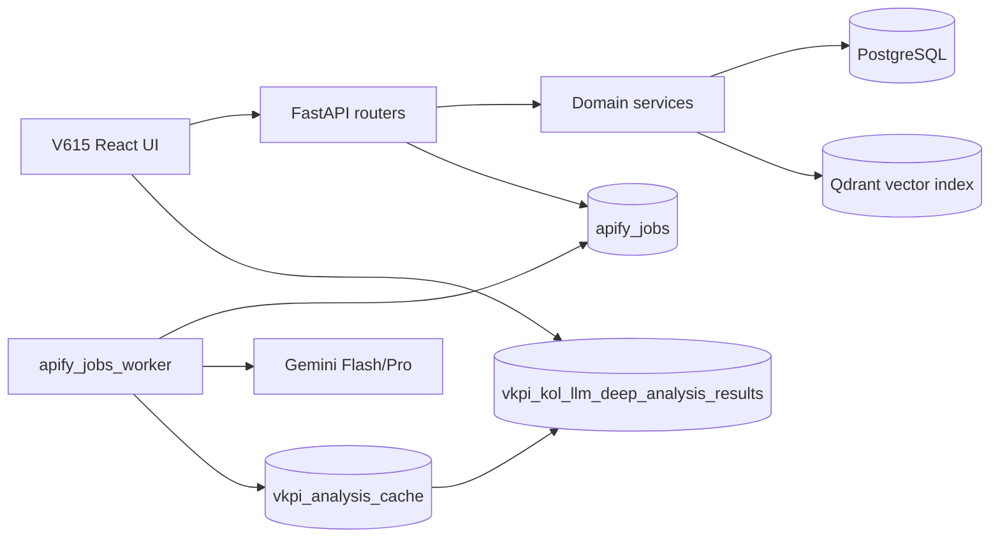
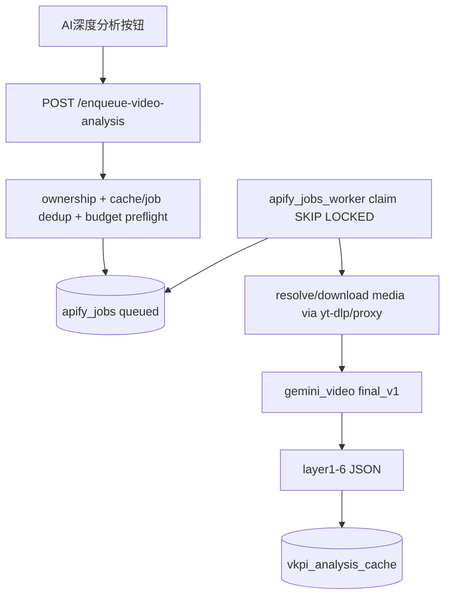
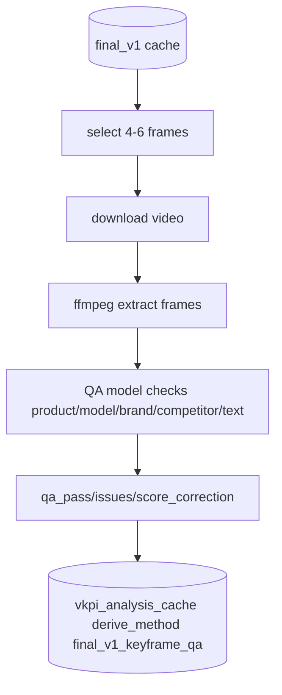
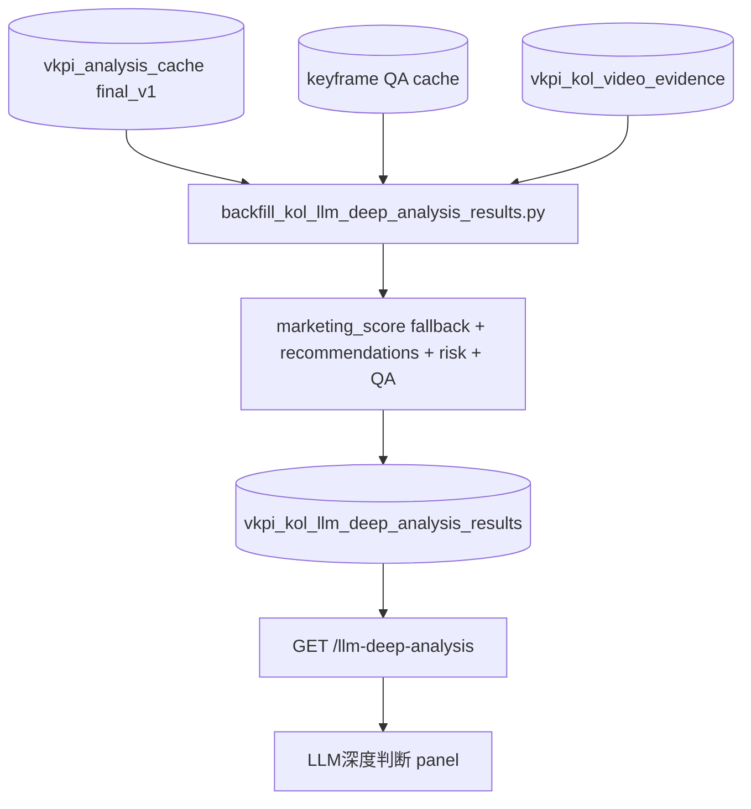
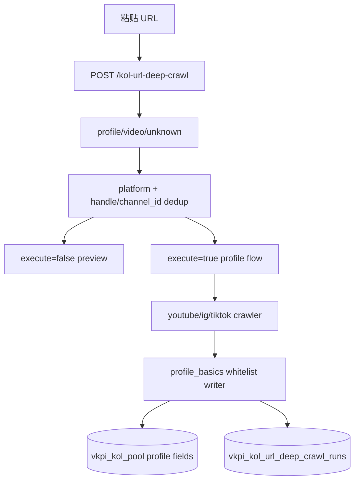
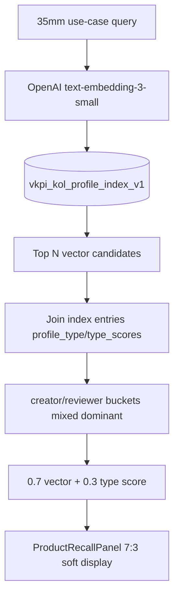
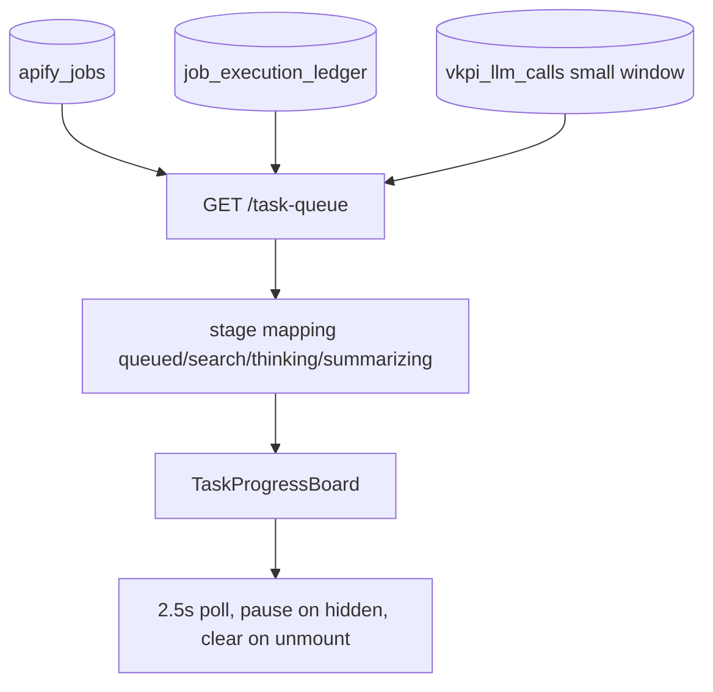

# V-KPI 链路图合集（可视化 PNG + Mermaid 源码）

生成日期：2026-06-07

## 系统总架构


## KOL Pool 主列表与详情


## V6 Fit 写口


## final_v1 视频深析


## Keyframe QA


## Deep Result 沉淀


## URL Deep Crawl


## Product Recall


## Task Queue 看板


---

# Mermaid 源码

## 系统总架构



## KOL Pool 主列表与详情

```mermaid
flowchart TD
  Page[KOLPoolPage] --> ListAPI[GET /kol-pool]
  ListAPI --> Pool[(vkpi_kol_pool)]
  Pool --> Sort[COALESCE(viltrox_fit_score,0) DESC]
  Page --> Drawer[KOLDetailDrawer]
  Drawer --> ItemAPI[GET /kol-pool/{id}]
  Drawer --> D11[GET /dimensions11]
  Drawer --> Deep[GET /llm-deep-analysis]
  Drawer --> Video[KOLVideoAnalysisPanel]
  Video --> Cache[(vkpi_analysis_cache)]
```

## V6 Fit 写口

```mermaid
flowchart TD
  EnrichAPI[POST /kol-pool/{id}/enrich] --> Enrich[pool.enrich_item]
  BatchAPI[POST /kol-pool/batch-enrich] --> Batch[pool.batch_enrich_items]
  WorkerTask[workers/tasks/vkpi.py] --> Enrich
  Daily[daily_sync.py] --> Enrich
  Enrich --> Rule[rule_v0 formula]
  Rule --> Score[(vkpi_kol_pool.viltrox_fit_score)]
  Batch --> Enrich
```

## final_v1 视频深析



## Keyframe QA



## Deep Result 沉淀



## URL Deep Crawl



## Product Recall



## Task Queue 看板



